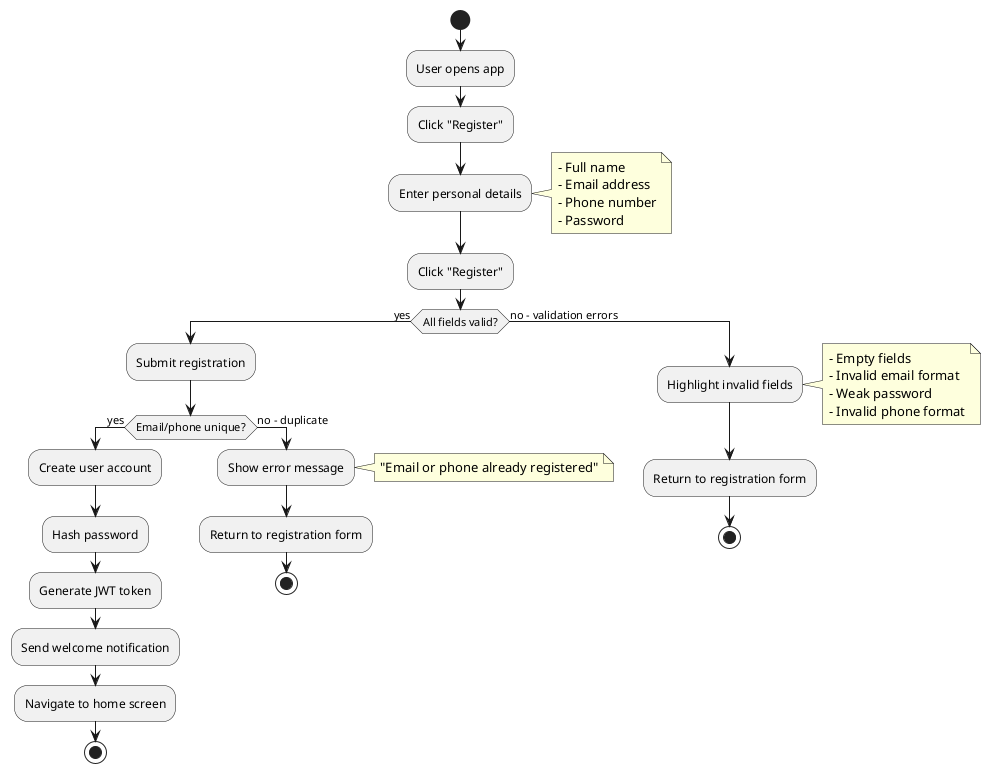
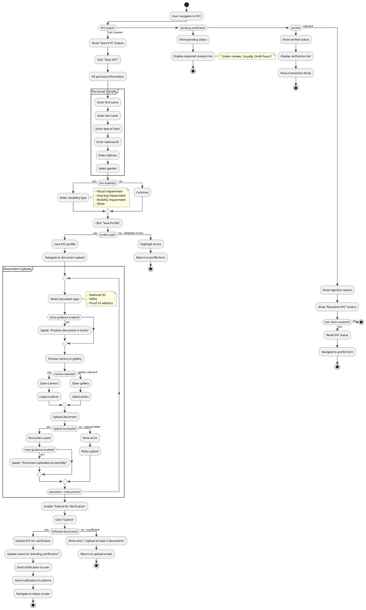
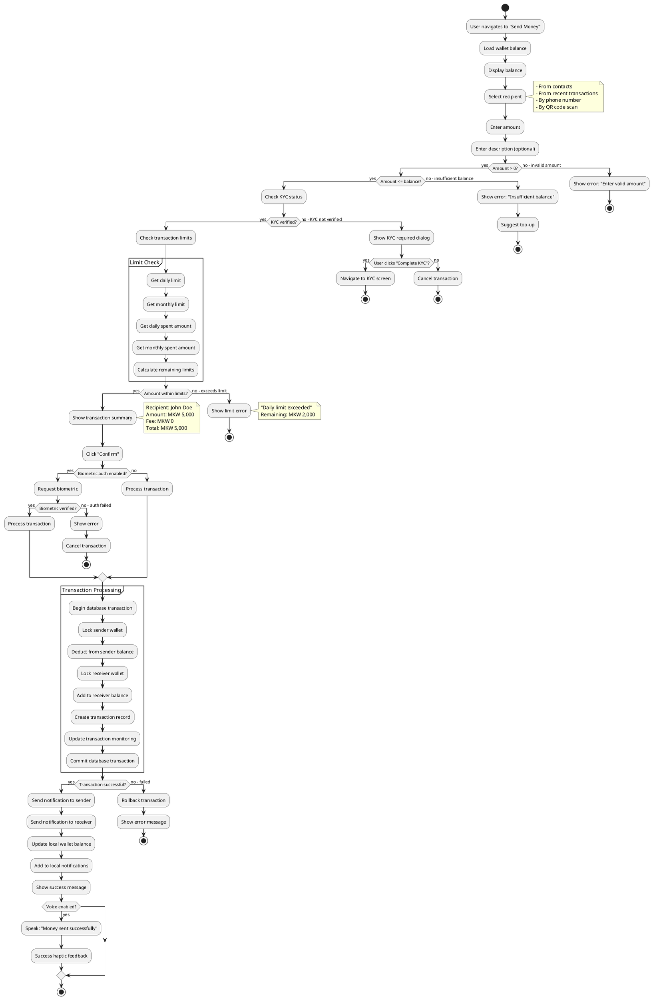
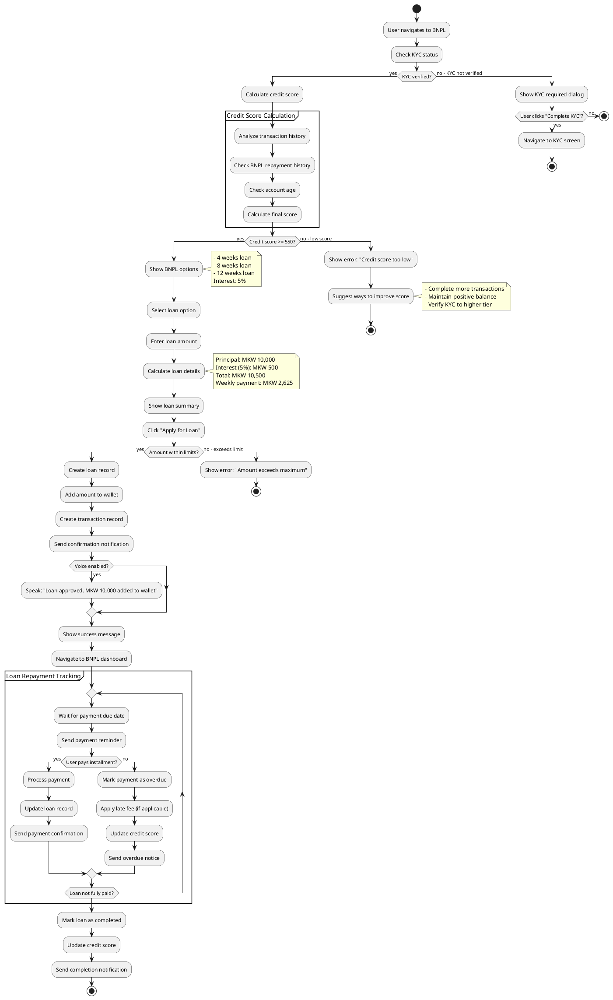
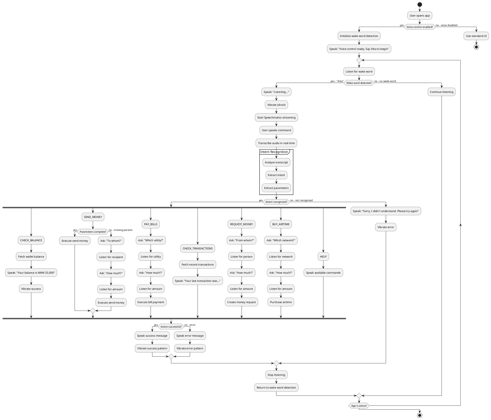
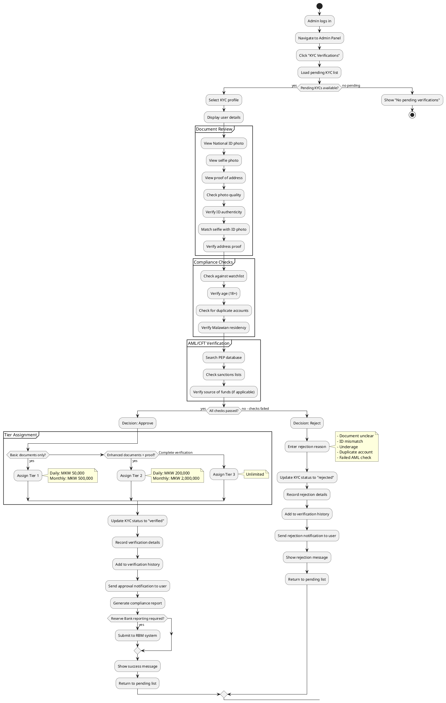
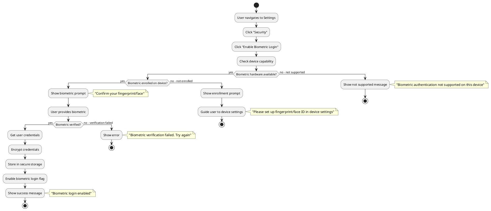
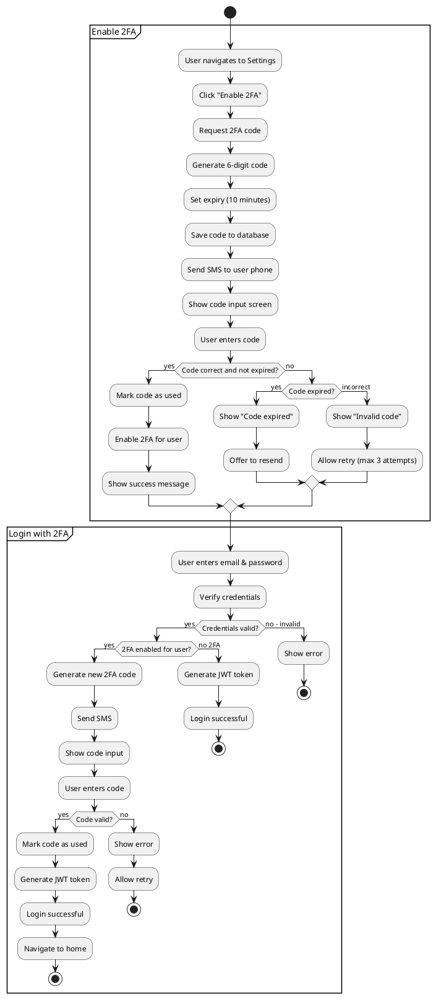

# InkaWallet Activity Diagrams

## User Registration Process

## KYC Submission Process

## Send Money Transaction Process

## BNPL Loan Application Process

## Voice Command Processing

## Admin KYC Verification Process

## Biometric Authentication Setup

## Two-Factor Authentication Flow

