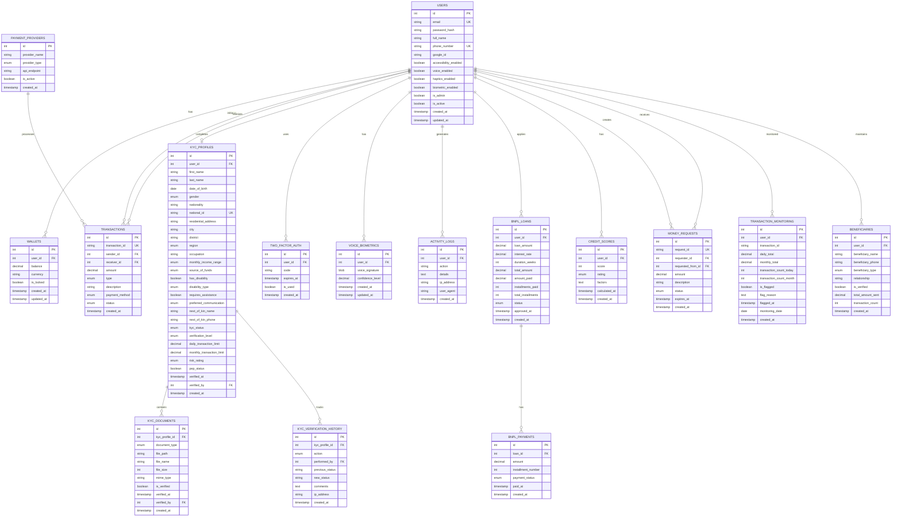

# InkaWallet Database Design

## Entity Relationship Diagram (ERD)



## Database Schema Details

### Core Tables

#### 1. USERS Table

**Purpose**: Store user account information  
**Key Relationships**:

- One user can have one wallet
- One user can have one KYC profile
- One user can have many transactions (sender/receiver)
- One user can have many BNPL loans

**Indexes**:

- PRIMARY KEY: id
- UNIQUE: email, phone_number
- INDEX: google_id, is_admin, is_active

---

#### 2. WALLETS Table

**Purpose**: Store wallet balance and currency information  
**Key Relationships**:

- One-to-one with USERS
- Balance must be non-negative (CHECK constraint)

**Business Rules**:

- Default currency: MKW (Malawian Kwacha)
- Locked wallets cannot transact
- Balance updated atomically with transactions

---

#### 3. TRANSACTIONS Table

**Purpose**: Record all financial transactions  
**Key Relationships**:

- Many-to-one with USERS (sender)
- Many-to-one with USERS (receiver)
- Many-to-one with PAYMENT_PROVIDERS

**Transaction Types**:

- send_money
- receive_money
- deposit
- withdrawal
- airtime_purchase
- bill_payment
- bnpl_payment

**Payment Methods**:

- inkawallet (internal)
- mpamba (TNM mobile money)
- airtel_money
- bank_transfer

**Status Values**:

- pending
- completed
- failed
- cancelled

---

#### 4. KYC_PROFILES Table

**Purpose**: Store customer KYC verification data  
**Key Relationships**:

- One-to-one with USERS
- One-to-many with KYC_DOCUMENTS
- One-to-many with KYC_VERIFICATION_HISTORY

**Verification Levels**:

- tier1: Basic (MKW 50K daily, 500K monthly)
- tier2: Enhanced (MKW 200K daily, 2M monthly)
- tier3: Full (Unlimited)

**KYC Status Values**:

- incomplete
- pending_verification
- verified
- rejected
- expired

**Risk Ratings**:

- low: Regular customer
- medium: Higher transaction volume
- high: PEP or suspicious activity

---

### Supporting Tables

#### 5. KYC_DOCUMENTS Table

**Purpose**: Store uploaded KYC verification documents  
**Document Types**:

- national_id_front
- national_id_back
- passport
- drivers_license
- voters_id
- proof_of_address
- selfie
- employment_letter

**Storage**: Files stored in `/backend/uploads/kyc-documents/`

---

#### 6. TRANSACTION_MONITORING Table

**Purpose**: AML/CFT compliance monitoring  
**Key Features**:

- Daily transaction totals
- Monthly transaction totals
- Suspicious activity flagging
- Investigation tracking

**Flagging Rules**:

- Single transaction > MKW 1,000,000
- Daily total > 150% of KYC limit
- Unusual transaction patterns
- Multiple transactions in short time

---

#### 7. BNPL_LOANS Table

**Purpose**: Buy Now Pay Later loan management  
**Key Relationships**:

- Many-to-one with USERS
- One-to-many with BNPL_PAYMENTS

**Loan Status**:

- pending
- approved
- active
- completed
- defaulted

**Business Rules**:

- Interest rate: 5% default
- Duration: 4-12 weeks
- Requires verified KYC (tier1+)

---

#### 8. CREDIT_SCORES Table

**Purpose**: Store user credit score calculations  
**Rating System**:

- excellent: 750-850
- good: 650-749
- fair: 550-649
- poor: 300-549

**Factors Considered**:

- Transaction history
- BNPL repayment history
- Account age
- KYC verification level

---

## Database Normalization

### Normal Forms Applied

**1st Normal Form (1NF)**: ✅

- All tables have atomic values
- No repeating groups
- Each column contains single values

**2nd Normal Form (2NF)**: ✅

- All tables in 1NF
- No partial dependencies
- All non-key attributes fully dependent on primary key

**3rd Normal Form (3NF)**: ✅

- All tables in 2NF
- No transitive dependencies
- All attributes depend only on primary key

### Denormalization Decisions

**TRANSACTION_MONITORING Table**:

- Stores daily/monthly totals (denormalized)
- **Reason**: Performance - avoid aggregating millions of transactions
- **Trade-off**: Slightly redundant data for faster limit checks

**KYC_PROFILES Table**:

- Stores transaction limits (denormalized)
- **Reason**: Business logic - limits vary per user
- **Trade-off**: Flexibility over pure normalization

---

## Indexes Strategy

### Primary Indexes

```sql
-- High-frequency lookups
CREATE INDEX idx_users_email ON users(email);
CREATE INDEX idx_users_phone ON users(phone_number);
CREATE INDEX idx_transactions_sender ON transactions(sender_id);
CREATE INDEX idx_transactions_receiver ON transactions(receiver_id);
CREATE INDEX idx_transactions_status ON transactions(status);

-- KYC lookups
CREATE INDEX idx_kyc_user ON kyc_profiles(user_id);
CREATE INDEX idx_kyc_status ON kyc_profiles(kyc_status);
CREATE INDEX idx_kyc_national_id ON kyc_profiles(national_id);

-- Transaction monitoring
CREATE INDEX idx_monitoring_user_date ON transaction_monitoring(user_id, monitoring_date);
CREATE INDEX idx_monitoring_flagged ON transaction_monitoring(is_flagged);

-- BNPL queries
CREATE INDEX idx_bnpl_user ON bnpl_loans(user_id);
CREATE INDEX idx_bnpl_status ON bnpl_loans(status);
```

### Composite Indexes

```sql
-- User authentication
CREATE INDEX idx_users_email_active ON users(email, is_active);

-- Transaction queries
CREATE INDEX idx_tx_user_date ON transactions(sender_id, created_at);
CREATE INDEX idx_tx_type_status ON transactions(type, status);

-- KYC verification
CREATE INDEX idx_kyc_status_created ON kyc_profiles(kyc_status, created_at);
```

---

## Data Constraints

### Check Constraints

```sql
-- Wallet balance must be non-negative
ALTER TABLE wallets ADD CONSTRAINT chk_balance_positive
    CHECK (balance >= 0);

-- Transaction amount must be positive
ALTER TABLE transactions ADD CONSTRAINT chk_amount_positive
    CHECK (amount > 0);

-- Credit score in valid range
ALTER TABLE credit_scores ADD CONSTRAINT chk_score_range
    CHECK (score >= 300 AND score <= 850);

-- BNPL interest rate reasonable
ALTER TABLE bnpl_loans ADD CONSTRAINT chk_interest_rate
    CHECK (interest_rate >= 0 AND interest_rate <= 50);

-- KYC limits positive
ALTER TABLE kyc_profiles ADD CONSTRAINT chk_limits_positive
    CHECK (daily_transaction_limit >= 0 AND monthly_transaction_limit >= 0);
```

### Foreign Key Constraints

```sql
-- All user-related foreign keys
ALTER TABLE wallets ADD CONSTRAINT fk_wallet_user
    FOREIGN KEY (user_id) REFERENCES users(id) ON DELETE CASCADE;

ALTER TABLE kyc_profiles ADD CONSTRAINT fk_kyc_user
    FOREIGN KEY (user_id) REFERENCES users(id) ON DELETE CASCADE;

-- Transaction foreign keys (preserve on user deletion)
ALTER TABLE transactions ADD CONSTRAINT fk_tx_sender
    FOREIGN KEY (sender_id) REFERENCES users(id) ON DELETE SET NULL;

ALTER TABLE transactions ADD CONSTRAINT fk_tx_receiver
    FOREIGN KEY (receiver_id) REFERENCES users(id) ON DELETE SET NULL;

-- KYC verification tracking
ALTER TABLE kyc_profiles ADD CONSTRAINT fk_kyc_verifier
    FOREIGN KEY (verified_by) REFERENCES users(id) ON DELETE SET NULL;
```

---

## Data Security

### Encryption

- **Passwords**: Bcrypt hashing (salt rounds: 10)
- **Sensitive PII**: AES-256 encryption at rest
- **Data in transit**: SSL/TLS 1.3

### Access Control

- **Admin users**: is_admin = true
- **Row-level security**: Users can only access their own data
- **Audit logs**: All KYC actions logged with IP addresses

### Backup Strategy

- **Full backup**: Daily at 2:00 AM
- **Incremental backup**: Every 6 hours
- **Retention**: 30 days
- **Off-site replication**: AWS S3 backup

---

## Performance Considerations

### Query Optimization

1. **Transaction queries**: Indexed by user_id and created_at
2. **KYC searches**: Indexed by status and national_id
3. **Monitoring**: Composite index on user_id + date

### Partitioning Strategy

```sql
-- Partition transactions by date (future optimization)
CREATE TABLE transactions (
    ...
) PARTITION BY RANGE (YEAR(created_at)) (
    PARTITION p2024 VALUES LESS THAN (2025),
    PARTITION p2025 VALUES LESS THAN (2026),
    PARTITION p2026 VALUES LESS THAN (2027),
    PARTITION pmax VALUES LESS THAN MAXVALUE
);
```

### Caching

- **User sessions**: Redis cache (TTL: 24 hours)
- **KYC status**: Application-level cache (TTL: 5 minutes)
- **Transaction limits**: Redis cache (TTL: 1 hour)

---

## Data Migration Plan

### Phase 1: Initial Setup

1. Create database schema
2. Create indexes
3. Insert default data (payment providers, admin user)

### Phase 2: Seed Data

1. Test users
2. Sample transactions
3. KYC test profiles

### Phase 3: Production

1. Migrate existing users (if any)
2. Verify data integrity
3. Enable constraints
4. Start monitoring
