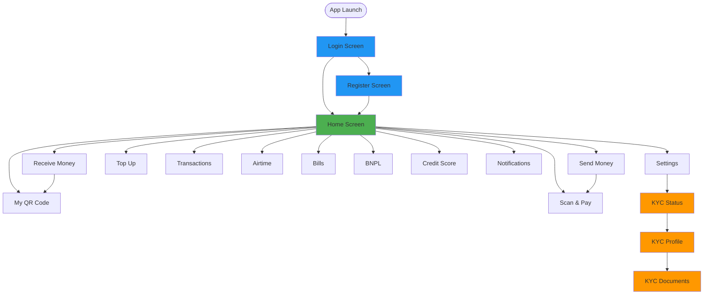
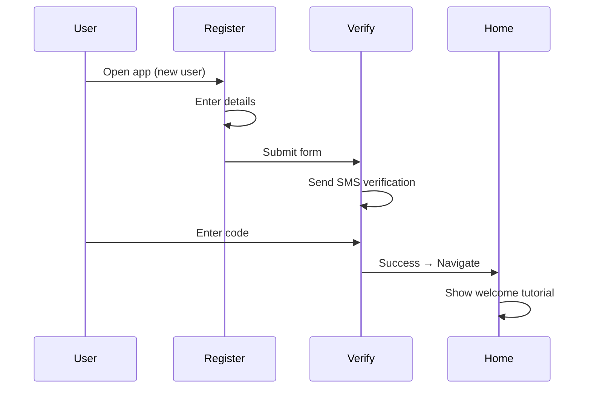
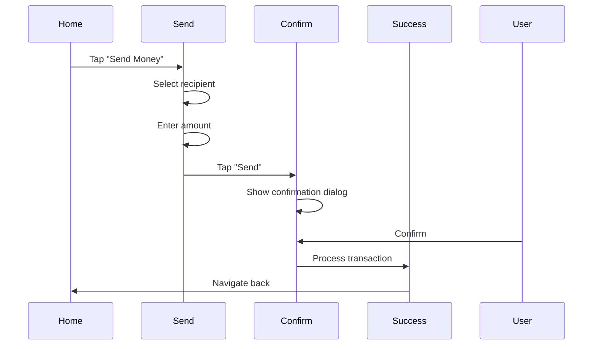
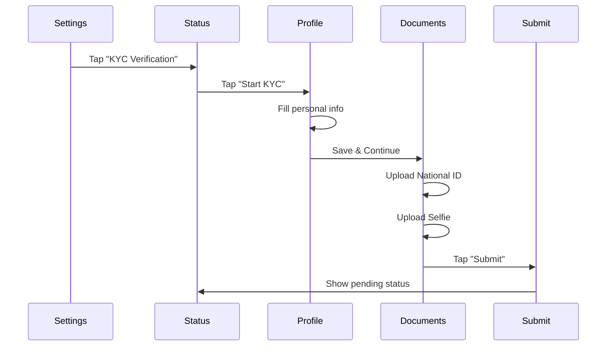

# InkaWallet Screen Designs & UI Specifications

## Overview

This document provides detailed screen designs, wireframes, UI specifications, and navigation flows for all 18 screens in the InkaWallet mobile application.

## Design Principles

### Accessibility First

- **Voice Control**: All screens support hands-free voice navigation via "Inka" wake word
- **Screen Reader**: All elements have semantic labels for TalkBack/VoiceOver
- **High Contrast**: Support for high contrast mode
- **Large Touch Targets**: Minimum 44x44 dp for all interactive elements
- **Text-to-Speech**: Audio feedback for all actions

### Visual Design

- **Color Scheme**:
  - Primary: Green (#4CAF50) - Trust, money, growth
  - Secondary: Blue (#2196F3) - Stability, security
  - Accent: Orange (#FF9800) - Energy, action
  - Error: Red (#F44336)
  - Success: Green (#4CAF50)
  - Background: White (#FFFFFF) / Dark (#121212) in dark mode
- **Typography**:
  - Headings: 24sp, Bold
  - Subheadings: 18sp, Medium
  - Body: 16sp, Regular
  - Caption: 14sp, Regular
- **Spacing**: 8dp grid system (8, 16, 24, 32, 40, 48)
- **Border Radius**: 8dp for cards, 24dp for buttons

---

## Screen Inventory

| #   | Screen Name   | Route            | Purpose                    | Voice Enabled |
| --- | ------------- | ---------------- | -------------------------- | ------------- |
| 1   | Login         | `/login`         | User authentication        | ✓             |
| 2   | Register      | `/register`      | New user registration      | ✓             |
| 3   | Home          | `/home`          | Main dashboard             | ✓             |
| 4   | Send Money    | `/send-money`    | Transfer money to others   | ✓             |
| 5   | Receive Money | `/receive-money` | Share receive details      | ✓             |
| 6   | My QR Code    | `/my-qr`         | Display user QR code       | ✓             |
| 7   | Scan & Pay    | `/scan-pay`      | QR code scanner            | ✓             |
| 8   | Top Up        | `/topup`         | Add money to wallet        | ✓             |
| 9   | Transactions  | `/transactions`  | Transaction history        | ✓             |
| 10  | Airtime       | `/airtime`       | Buy mobile airtime         | ✓             |
| 11  | Bills         | `/bills`         | Pay utility bills          | ✓             |
| 12  | BNPL          | `/bnpl`          | Buy Now Pay Later loans    | ✓             |
| 13  | Credit Score  | `/credit-score`  | View credit rating         | ✓             |
| 14  | KYC Profile   | `/kyc-profile`   | Submit KYC information     | ✓             |
| 15  | KYC Documents | `/kyc-documents` | Upload verification docs   | ✓             |
| 16  | KYC Status    | `/kyc-status`    | Check verification status  | ✓             |
| 17  | Notifications | `/notifications` | View all notifications     | ✓             |
| 18  | Settings      | `/settings`      | App settings & preferences | ✓             |

---

## Navigation Flow Diagram



---

## Screen Wireframes & Specifications

### 1. Login Screen

#### Wireframe

```
┌─────────────────────────────────────┐
│          InkaWallet                 │
│      [Logo - 120x120]              │
│                                     │
│  Welcome Back                       │
│  Accessible Banking for All         │
│                                     │
│  ┌─────────────────────────────┐  │
│  │ 📧 Email                    │  │
│  │ [email input field]         │  │
│  └─────────────────────────────┘  │
│                                     │
│  ┌─────────────────────────────┐  │
│  │ 🔒 Password                 │  │
│  │ [password input field] 👁   │  │
│  └─────────────────────────────┘  │
│                                     │
│  [ Forgot Password? ]              │
│                                     │
│  ┌─────────────────────────────┐  │
│  │      LOGIN                   │  │
│  └─────────────────────────────┘  │
│                                     │
│  ─────── OR ───────                │
│                                     │
│  ┌─────────────────────────────┐  │
│  │  🔑 Login with Biometric    │  │
│  └─────────────────────────────┘  │
│                                     │
│  ┌─────────────────────────────┐  │
│  │  🌐 Login with Google       │  │
│  └─────────────────────────────┘  │
│                                     │
│  Don't have an account?            │
│  [ Register Now ]                  │
│                                     │
│  🎤 Voice Control Active           │
└─────────────────────────────────────┘
```

#### UI Specifications

- **Components**:
  - Logo: 120x120 dp, centered
  - Title: "Welcome Back" - 24sp, bold
  - Subtitle: "Accessible Banking for All" - 16sp, regular
  - Email TextField: Full width minus 32dp margin
  - Password TextField: Full width with eye icon toggle
  - Login Button: Full width, 48dp height, primary color
  - Biometric Button: Full width, 48dp height, outlined
  - Google Button: Full width, 48dp height, white with border
  - Links: 14sp, blue color
  - Voice indicator: Bottom bar, 16sp, green

- **Voice Commands**:
  - "Login with email"
  - "Login with biometric"
  - "Login with Google"
  - "Register new account"

- **Accessibility**:
  - Email field: Semantic label "Email address"
  - Password field: Semantic label "Password", hint "Your password"
  - Eye icon: Semantic label "Toggle password visibility"
  - All buttons: Descriptive labels with action context

---

### 2. Register Screen

#### Wireframe

```
┌─────────────────────────────────────┐
│  ← Back        Create Account       │
│                                     │
│  Join InkaWallet Today              │
│  Free, secure, accessible           │
│                                     │
│  ┌─────────────────────────────┐  │
│  │ 👤 Full Name                │  │
│  │ [text input]                │  │
│  └─────────────────────────────┘  │
│                                     │
│  ┌─────────────────────────────┐  │
│  │ 📧 Email                    │  │
│  │ [email input]               │  │
│  └─────────────────────────────┘  │
│                                     │
│  ┌─────────────────────────────┐  │
│  │ 📱 Phone Number             │  │
│  │ +265 [phone input]          │  │
│  └─────────────────────────────┘  │
│                                     │
│  ┌─────────────────────────────┐  │
│  │ 🔒 Password                 │  │
│  │ [password input] 👁         │  │
│  └─────────────────────────────┘  │
│                                     │
│  Password Requirements:            │
│  ✓ 8+ characters                   │
│  ✓ Uppercase letter                │
│  ✓ Number                          │
│  ✗ Special character               │
│                                     │
│  ┌─────────────────────────────┐  │
│  │ 🔒 Confirm Password         │  │
│  │ [password input] 👁         │  │
│  └─────────────────────────────┘  │
│                                     │
│  ☑ I agree to Terms & Privacy     │
│                                     │
│  ┌─────────────────────────────┐  │
│  │      CREATE ACCOUNT          │  │
│  └─────────────────────────────┘  │
│                                     │
│  Already have an account?          │
│  [ Login ]                         │
└─────────────────────────────────────┘
```

#### UI Specifications

- **Components**:
  - AppBar: Back button (left), "Create Account" title
  - Form fields: Full width, 16dp horizontal margin
  - Password strength indicator: Real-time validation list
  - Checkbox: Terms agreement with link
  - Create button: Full width, 48dp height, primary color
  - Disabled state: Gray when form invalid

- **Validation**:
  - Real-time validation on each field
  - Email: RFC 5322 format
  - Phone: +265 followed by 9 digits
  - Password: 8+ chars, uppercase, number, special char
  - Confirm: Must match password

- **Voice Commands**:
  - "Fill registration form"
  - "Create account"
  - "Go to login"

---

### 3. Home Screen (Dashboard)

#### Wireframe

```
┌─────────────────────────────────────┐
│  ☰  InkaWallet          🔔(3) ⚙️   │
│                                     │
│  Hello, John! 👋                    │
│  Good afternoon                     │
│                                     │
│  ┌───────────────────────────────┐ │
│  │  Your Balance                 │ │
│  │  MKW 25,450.00        👁 Hide │ │
│  │                               │ │
│  │  KYC: Verified ✓   Tier 2    │ │
│  │  Daily Limit: MKW 150K used  │ │
│  └───────────────────────────────┘ │
│                                     │
│  Quick Actions                      │
│  ┌──────┐ ┌──────┐ ┌──────┐       │
│  │ Send │ │Recvr │ │ QR   │       │
│  │ 💸   │ │ 📥   │ │ 📱   │       │
│  └──────┘ └──────┘ └──────┘       │
│  ┌──────┐ ┌──────┐ ┌──────┐       │
│  │Topup │ │Bills │ │Airtm │       │
│  │ 💳   │ │ 💡   │ │ 📞   │       │
│  └──────┘ └──────┘ └──────┘       │
│                                     │
│  Services                           │
│  ┌─────────────────────────────┐  │
│  │ 🏦 BNPL Loans              │  │
│  │ Quick loans, pay later  →  │  │
│  └─────────────────────────────┘  │
│  ┌─────────────────────────────┐  │
│  │ 📊 Credit Score            │  │
│  │ Your score: 720 (Good)  →  │  │
│  └─────────────────────────────┘  │
│                                     │
│  Recent Transactions                │
│  ┌─────────────────────────────┐  │
│  │ 💸 Sent to Jane Doe        │  │
│  │ -MKW 5,000   2 hours ago    │  │
│  └─────────────────────────────┘  │
│  ┌─────────────────────────────┐  │
│  │ 📥 Received from Mike       │  │
│  │ +MKW 12,000  Yesterday      │  │
│  └─────────────────────────────┘  │
│                                     │
│  [ View All Transactions ]         │
│                                     │
│  🎤 Say "Inka" to use voice        │
└─────────────────────────────────────┘
```

#### UI Specifications

- **App Bar**:
  - Menu icon (left): Opens drawer
  - Notification icon (right): Badge with count
  - Settings icon (right): Navigate to settings

- **Balance Card**:
  - Prominent card at top
  - Large balance text: 32sp, bold
  - Toggle visibility icon
  - KYC status badge (colored: verified=green)
  - Transaction limit progress bar

- **Quick Actions Grid**:
  - 3x2 grid layout
  - Each card: 100x100 dp
  - Icon: 48x48 dp, centered
  - Label: 14sp, centered below icon
  - Elevation: 2dp
  - Border radius: 16dp

- **Services Cards**:
  - Full width cards
  - 16dp margin
  - Icon left, text center, arrow right
  - 64dp height

- **Recent Transactions**:
  - List of last 3 transactions
  - Avatar/icon left
  - Amount right (colored: green=positive, red=negative)
  - Description and time below

- **Voice Commands**:
  - "Check my balance"
  - "Send money"
  - "Receive money"
  - "Pay bills"
  - "Buy airtime"
  - "Top up wallet"
  - "View transactions"
  - "Check credit score"
  - "Open BNPL"

---

### 4. Send Money Screen

#### Wireframe

```
┌─────────────────────────────────────┐
│  ← Back        Send Money           │
│                                     │
│  Balance: MKW 25,450.00             │
│                                     │
│  Recipient                          │
│  ┌─────────────────────────────┐  │
│  │ 🔍 Search contacts or       │  │
│  │    enter phone number       │  │
│  └─────────────────────────────┘  │
│                                     │
│  Recent Recipients                  │
│  ┌──────┐ ┌──────┐ ┌──────┐       │
│  │  JD  │ │  MW  │ │  SA  │       │
│  │ Jane │ │ Mike │ │Sarah │       │
│  └──────┘ └──────┘ └──────┘       │
│                                     │
│  Amount (MKW)                       │
│  ┌─────────────────────────────┐  │
│  │ [     5,000.00         ]    │  │
│  └─────────────────────────────┘  │
│                                     │
│  Quick Amounts                      │
│  [ 1K ] [ 5K ] [ 10K ] [ 20K ]    │
│                                     │
│  Description (Optional)             │
│  ┌─────────────────────────────┐  │
│  │ [Add a note...]             │  │
│  └─────────────────────────────┘  │
│                                     │
│  Transaction Summary                │
│  ┌─────────────────────────────┐  │
│  │ Amount:        MKW 5,000.00 │  │
│  │ Fee:               MKW 0.00 │  │
│  │ ─────────────────────────── │  │
│  │ Total:         MKW 5,000.00 │  │
│  └─────────────────────────────┘  │
│                                     │
│  Daily Limit Remaining: 45,000     │
│                                     │
│  ┌─────────────────────────────┐  │
│  │      SEND MONEY              │  │
│  └─────────────────────────────┘  │
│                                     │
│  [ Scan QR Code ]                  │
└─────────────────────────────────────┘
```

#### UI Specifications

- **Search Field**:
  - Autocomplete from contacts
  - Phone number validation (+265)
  - Search icon left, clear icon right

- **Recent Recipients**:
  - Horizontal scrollable list
  - Avatar with initials
  - Name below
  - Tap to select

- **Amount Field**:
  - Numeric keyboard
  - Large text: 24sp
  - Thousand separator formatting
  - Real-time validation

- **Quick Amount Buttons**:
  - Chips layout: 4 buttons
  - Values: 1000, 5000, 10000, 20000
  - Tap to auto-fill

- **Summary Card**:
  - Outlined card
  - Line items with labels left, values right
  - Divider before total
  - Total in bold

- **Send Button**:
  - Disabled until valid recipient and amount
  - Shows loading spinner on tap
  - Biometric prompt if > 10,000

- **Voice Commands**:
  - "Send 5000 to Jane"
  - "Send money to phone number [number]"
  - "Send 1000 kwacha"

---

### 5. Receive Money Screen

#### Wireframe

```
┌─────────────────────────────────────┐
│  ← Back     Receive Money           │
│                                     │
│  Share your payment details         │
│                                     │
│  Your QR Code                       │
│  ┌─────────────────────────────┐  │
│  │                             │  │
│  │     [QR Code 200x200]       │  │
│  │                             │  │
│  │     John Banda              │  │
│  │     +265 999 123 456        │  │
│  └─────────────────────────────┘  │
│                                     │
│  [ Save QR Code ]                  │
│  [ Share QR Code ]                 │
│                                     │
│  ─────────── OR ───────────        │
│                                     │
│  Your Details                       │
│  ┌─────────────────────────────┐  │
│  │ Name:    John Banda         │  │
│  │ Phone:   +265 999 123 456   │  │
│  │ Account: JB-123456          │  │
│  └─────────────────────────────┘  │
│                                     │
│  [ Copy Details ]                  │
│  [ Share via SMS ]                 │
│  [ Share via WhatsApp ]            │
│                                     │
│  Request Money                      │
│  ┌─────────────────────────────┐  │
│  │ Select Contact    [       ] │  │
│  │ Amount (MKW)      [       ] │  │
│  │                             │  │
│  │ [ Send Request ]            │  │
│  └─────────────────────────────┘  │
│                                     │
│  Recent Requests                    │
│  ┌─────────────────────────────┐  │
│  │ From Mike - MKW 2,000       │  │
│  │ Pending      [Accept][Decline]│
│  └─────────────────────────────┘  │
└─────────────────────────────────────┘
```

#### UI Specifications

- **QR Code Display**:
  - 200x200 dp QR code
  - Centered in card
  - User name and phone below
  - Card elevation: 4dp

- **Action Buttons**:
  - Save: Downloads QR to gallery
  - Share: Native share sheet

- **Details Card**:
  - Read-only text fields
  - Copy icon next to each field
  - Tap to copy with toast notification

- **Share Options**:
  - SMS: Pre-filled message with details
  - WhatsApp: Deep link with message

- **Request Section**:
  - Compact form
  - Contact picker
  - Amount input
  - Sends notification to recipient

- **Voice Commands**:
  - "Show my QR code"
  - "Request 5000 from Mike"
  - "Share payment details"

---

### 6. Top Up Screen

#### Wireframe

```
┌─────────────────────────────────────┐
│  ← Back        Top Up Wallet        │
│                                     │
│  Current Balance: MKW 25,450.00     │
│                                     │
│  Select Top-Up Method               │
│  ┌─────────────────────────────┐  │
│  │ ○ TNM Mpamba                │  │
│  │   Fast, secure, 0% fee       │  │
│  └─────────────────────────────┘  │
│  ┌─────────────────────────────┐  │
│  │ ○ Airtel Money              │  │
│  │   Instant, 0% fee            │  │
│  └─────────────────────────────┘  │
│  ┌─────────────────────────────┐  │
│  │ ○ Bank Transfer             │  │
│  │   1-2 business days          │  │
│  └─────────────────────────────┘  │
│                                     │
│  Amount to Add (MKW)                │
│  ┌─────────────────────────────┐  │
│  │ [     10,000.00        ]    │  │
│  └─────────────────────────────┘  │
│  Min: 100  Max: 500,000            │
│                                     │
│  Quick Amounts                      │
│  [ 1K ] [ 5K ] [ 10K ] [ 50K ]    │
│                                     │
│  ┌─────────────────────────────┐  │
│  │ Amount:       MKW 10,000.00 │  │
│  │ Fee:              MKW 0.00  │  │
│  │ ─────────────────────────── │  │
│  │ Total:        MKW 10,000.00 │  │
│  │                             │  │
│  │ New Balance:  MKW 35,450.00 │  │
│  └─────────────────────────────┘  │
│                                     │
│  ┌─────────────────────────────┐  │
│  │      TOP UP NOW              │  │
│  └─────────────────────────────┘  │
│                                     │
│  🔒 Secured by 256-bit encryption  │
└─────────────────────────────────────┘
```

#### UI Specifications

- **Payment Method Cards**:
  - Radio button selection
  - Provider logo left
  - Name and description
  - Selected: Highlighted border (primary color)

- **Amount Input**:
  - Large numeric field
  - Min/max validation
  - Error message if out of range

- **Quick Amounts**:
  - 4 chip buttons
  - Common values: 1K, 5K, 10K, 50K

- **Summary Card**:
  - Shows calculation
  - New balance preview in bold

- **Top Up Button**:
  - Redirects to provider (Mpamba/Airtel)
  - Shows loading state
  - Disabled if invalid amount

- **Voice Commands**:
  - "Top up 10,000 using Mpamba"
  - "Add 5000 to wallet"

---

### 7. Transactions Screen

#### Wireframe

```
┌─────────────────────────────────────┐
│  ← Back      Transactions           │
│                                     │
│  ┌─────┬─────┬─────┬─────┬─────┐  │
│  │ All │Send │Recv │Bills│BNPL │  │
│  └─────┴─────┴─────┴─────┴─────┘  │
│                                     │
│  🔍 [Search transactions...]       │
│                                     │
│  📅 Filter by date                 │
│  [ Today ▼ ]  [ Export PDF ]       │
│                                     │
│  February 2026                      │
│  ┌─────────────────────────────┐  │
│  │ 💸 Sent to Jane Doe         │  │
│  │ Feb 23, 2:30 PM             │  │
│  │                 -MKW 5,000  │  │
│  │ Ref: TX-2026-02-23-001     │  │
│  └─────────────────────────────┘  │
│  ┌─────────────────────────────┐  │
│  │ 📥 Received from Mike       │  │
│  │ Feb 22, 10:15 AM            │  │
│  │                +MKW 12,000  │  │
│  │ Ref: TX-2026-02-22-045     │  │
│  └─────────────────────────────┘  │
│  ┌─────────────────────────────┐  │
│  │ 💡 ESCOM Bill Payment       │  │
│  │ Feb 20, 6:45 PM             │  │
│  │                 -MKW 3,500  │  │
│  │ Ref: TX-2026-02-20-132     │  │
│  └─────────────────────────────┘  │
│  ┌─────────────────────────────┐  │
│  │ 📞 Airtel Airtime           │  │
│  │ Feb 19, 8:00 AM             │  │
│  │                 -MKW 1,000  │  │
│  │ Ref: TX-2026-02-19-008     │  │
│  └─────────────────────────────┘  │
│                                     │
│  January 2026                       │
│  ┌─────────────────────────────┐  │
│  │ 🏦 BNPL Loan Disbursed      │  │
│  │ Jan 15, 9:00 AM             │  │
│  │                +MKW 10,000  │  │
│  └─────────────────────────────┘  │
│                                     │
│  [ Load More ]                     │
└─────────────────────────────────────┘
```

#### UI Specifications

- **Tab Bar**:
  - 5 tabs: All, Send, Receive, Bills, BNPL
  - Selected: Underline in primary color
  - Scrollable horizontally

- **Search Bar**:
  - Search by recipient, amount, reference
  - Debounced search (300ms)
  - Clear button when typing

- **Filters**:
  - Date dropdown: Today, Week, Month, Custom
  - Export button: Generates PDF

- **Transaction Cards**:
  - Icon left (type-specific)
  - Title and date/time
  - Amount right (colored: red=debit, green=credit)
  - Reference number in small text
  - Tap to view details

- **Grouping**:
  - Grouped by month
  - Month header: Bold, 18sp

- **Infinite Scroll**:
  - Load 20 transactions per page
  - "Load More" button at bottom

- **Voice Commands**:
  - "Show all transactions"
  - "Show sent money"
  - "Show this week's transactions"

---

### 8. KYC Status Screen

#### Wireframe

```
┌─────────────────────────────────────┐
│  ← Back     KYC Verification        │
│                                     │
│  Verification Status                │
│  ┌─────────────────────────────┐  │
│  │         ✓ VERIFIED           │  │
│  │                             │  │
│  │   Your KYC is approved      │  │
│  │   Tier 2 Verification       │  │
│  └─────────────────────────────┘  │
│                                     │
│  Your Details                       │
│  ┌─────────────────────────────┐  │
│  │ Name:     John Banda        │  │
│  │ ID:       1234-5678-9012    │  │
│  │ Tier:     Tier 2            │  │
│  │ Verified: Feb 1, 2026       │  │
│  └─────────────────────────────┘  │
│                                     │
│  Transaction Limits                 │
│  ┌─────────────────────────────┐  │
│  │ Daily Limit                 │  │
│  │ ████████░░ 80%              │  │
│  │ MKW 160,000 / 200,000       │  │
│  │                             │  │
│  │ Monthly Limit               │  │
│  │ ███░░░░░░░ 30%              │  │
│  │ MKW 600,000 / 2,000,000     │  │
│  └─────────────────────────────┘  │
│                                     │
│  Tier Benefits                      │
│  ┌─────────────────────────────┐  │
│  │ ✓ Send up to MKW 200K/day   │  │
│  │ ✓ BNPL loans up to 50K      │  │
│  │ ✓ Lower interest rates      │  │
│  │ ✓ Priority support          │  │
│  └─────────────────────────────┘  │
│                                     │
│  Want higher limits?                │
│  ┌─────────────────────────────┐  │
│  │    UPGRADE TO TIER 3         │  │
│  └─────────────────────────────┘  │
│                                     │
│  Verification History               │
│  • Verified: Feb 1, 2026            │
│  • Submitted: Jan 30, 2026          │
│  • Profile Created: Jan 29, 2026    │
└─────────────────────────────────────┘
```

#### UI Specifications

- **Status Card**:
  - Large status indicator (icon + text)
  - Color-coded:
    - Verified: Green background
    - Pending: Orange background
    - Rejected: Red background
    - Not Started: Gray background
  - Status-specific message

- **Details Card**:
  - Read-only information
  - Label-value pairs

- **Limits Section**:
  - Progress bars for daily/monthly
  - Percentage and amounts
  - Animated progress on load

- **Benefits List**:
  - Checkmark bullets
  - Tier-specific benefits

- **Upgrade Button**:
  - Only shown if not Tier 3
  - Navigates to upgrade flow

- **History Timeline**:
  - Chronological events
  - Bullet points with dates

- **Voice Commands**:
  - "Check KYC status"
  - "What's my verification tier"
  - "How much can I send today"

---

### 9. BNPL Screen

#### Wireframe

```
┌─────────────────────────────────────┐
│  ← Back    Buy Now Pay Later        │
│                                     │
│  Your Credit Score                  │
│  ┌─────────────────────────────┐  │
│  │   720 - Good ⭐⭐⭐⭐        │  │
│  │   Eligible for loans        │  │
│  └─────────────────────────────┘  │
│                                     │
│  Active Loans                       │
│  ┌─────────────────────────────┐  │
│  │ Loan #1234                  │  │
│  │ MKW 10,000 @ 5%             │  │
│  │                             │  │
│  │ Next Payment: Feb 28        │  │
│  │ Amount: MKW 2,625           │  │
│  │                             │  │
│  │ Progress: ████░░ 2/4 paid   │  │
│  │                             │  │
│  │ [ Pay Now ] [ View Details ]│  │
│  └─────────────────────────────┘  │
│                                     │
│  Available Loan Options             │
│  ┌─────────────────────────────┐  │
│  │ 4 Weeks Loan                │  │
│  │ Interest: 5%                │  │
│  │ Max: MKW 50,000             │  │
│  │ Weekly: MKW 2,625           │  │
│  │ [ Select ]                  │  │
│  └─────────────────────────────┘  │
│  ┌─────────────────────────────┐  │
│  │ 8 Weeks Loan                │  │
│  │ Interest: 8%                │  │
│  │ Max: MKW 50,000             │  │
│  │ Weekly: MKW 1,350           │  │
│  │ [ Select ]                  │  │
│  └─────────────────────────────┘  │
│  ┌─────────────────────────────┐  │
│  │ 12 Weeks Loan               │  │
│  │ Interest: 10%               │  │
│  │ Max: MKW 50,000             │  │
│  │ Weekly: MKW 917             │  │
│  │ [ Select ]                  │  │
│  └─────────────────────────────┘  │
│                                     │
│  Payment History                    │
│  • Feb 21: MKW 2,625 ✓             │
│  • Feb 14: MKW 2,625 ✓             │
│  • Feb 7: MKW 2,625 (Overdue)      │
└─────────────────────────────────────┘
```

#### UI Specifications

- **Credit Score Card**:
  - Large score number: 48sp
  - Rating text and stars
  - Color-coded: Poor=red, Fair=orange, Good=green, Excellent=blue
  - Eligibility message

- **Active Loans**:
  - Card per active loan
  - Loan details at top
  - Next payment highlighted
  - Progress bar showing payments
  - Action buttons at bottom

- **Loan Options**:
  - Card per option
  - Duration and interest prominent
  - Weekly payment calculation
  - Select button navigates to application

- **Payment History**:
  - List of past payments
  - Checkmark for paid
  - Warning icon for overdue

- **Voice Commands**:
  - "Apply for BNPL loan"
  - "Pay BNPL installment"
  - "Check loan balance"

---

### 10. Settings Screen

#### Wireframe

```
┌─────────────────────────────────────┐
│  ← Back        Settings             │
│                                     │
│  Account                            │
│  ┌─────────────────────────────┐  │
│  │ 👤 Profile                  │  │
│  │    John Banda            →  │  │
│  └─────────────────────────────┘  │
│  ┌─────────────────────────────┐  │
│  │ 🔐 KYC Verification         │  │
│  │    Tier 2 - Verified     →  │  │
│  └─────────────────────────────┘  │
│  ┌─────────────────────────────┐  │
│  │ 🔒 Change Password          │  │
│  │                          →  │  │
│  └─────────────────────────────┘  │
│                                     │
│  Security                           │
│  ┌─────────────────────────────┐  │
│  │ 🔑 Biometric Login          │  │
│  │                    [Toggle] │  │
│  └─────────────────────────────┘  │
│  ┌─────────────────────────────┐  │
│  │ 📱 Two-Factor Auth          │  │
│  │                    [Toggle] │  │
│  └─────────────────────────────┘  │
│                                     │
│  Accessibility                      │
│  ┌─────────────────────────────┐  │
│  │ 🎤 Voice Control            │  │
│  │                    [Toggle] │  │
│  └─────────────────────────────┘  │
│  ┌─────────────────────────────┐  │
│  │ 🗣️ Text-to-Speech          │  │
│  │                    [Toggle] │  │
│  └─────────────────────────────┘  │
│  ┌─────────────────────────────┐  │
│  │ 🌗 High Contrast Mode       │  │
│  │                    [Toggle] │  │
│  └─────────────────────────────┘  │
│  ┌─────────────────────────────┐  │
│  │ 🔤 Font Size                │  │
│  │    ──●────── 150%        →  │  │
│  └─────────────────────────────┘  │
│                                     │
│  Notifications                      │
│  ┌─────────────────────────────┐  │
│  │ 🔔 Push Notifications       │  │
│  │                    [Toggle] │  │
│  └─────────────────────────────┘  │
│  ┌─────────────────────────────┐  │
│  │ 📧 Email Notifications      │  │
│  │                    [Toggle] │  │
│  └─────────────────────────────┘  │
│                                     │
│  About                              │
│  ┌─────────────────────────────┐  │
│  │ ℹ️ About InkaWallet         │  │
│  │    Version 1.0.0         →  │  │
│  └─────────────────────────────┘  │
│  ┌─────────────────────────────┐  │
│  │ 📜 Terms & Privacy          │  │
│  │                          →  │  │
│  └─────────────────────────────┘  │
│  ┌─────────────────────────────┐  │
│  │ 🚪 Logout                   │  │
│  └─────────────────────────────┘  │
└─────────────────────────────────────┘
```

#### UI Specifications

- **Section Headers**:
  - 18sp, bold, gray color
  - 16dp top margin

- **Setting Items**:
  - List tiles with icon left
  - Title and subtitle
  - Toggle switch or arrow right
  - Dividers between items

- **Toggles**:
  - Material Switch component
  - Animated state change
  - Confirmation dialog for critical toggles

- **Sliders**:
  - Font size: 100%-200% range
  - Live preview of current value

- **Navigation Items**:
  - Arrow icon right
  - Navigate to detail screen

- **Logout Button**:
  - Red text color
  - Confirmation dialog
  - Clears session and navigates to login

- **Voice Commands**:
  - "Enable voice control"
  - "Turn on biometric login"
  - "Logout"

---

## Screen Flows

### User Registration Flow



### Money Transfer Flow



### KYC Submission Flow



---

## Accessibility Features

### Voice Control Integration

All screens support voice commands:

- **Wake Word**: "Inka" activates listening
- **Natural Language**: "Send 5000 to Jane"
- **Confirmation**: TTS reads back actions
- **Feedback**: Haptic vibrations for success/error

### Screen Reader Support

- **Semantic Labels**: All buttons, inputs labeled
- **Reading Order**: Logical top-to-bottom flow
- **Hints**: Context-specific hints for actions
- **Announcements**: State changes announced

### Visual Accessibility

- **High Contrast**: Toggle in settings
- **Font Scaling**: 100%-200% support
- **Color Blind**: No color-only information
- **Focus Indicators**: Clear focus states

---

## Design Tokens

### Colors

```dart
// Primary Colors
const Color primary = Color(0xFF4CAF50);      // Green
const Color secondary = Color(0xFF2196F3);    // Blue
const Color accent = Color(0xFFFF9800);       // Orange

// Status Colors
const Color success = Color(0xFF4CAF50);      // Green
const Color error = Color(0xFFF44336);        // Red
const Color warning = Color(0xFFFF9800);      // Orange
const Color info = Color(0xFF2196F3);         // Blue

// Neutral Colors
const Color background = Color(0xFFFFFFFF);   // White
const Color surface = Color(0xFFF5F5F5);      // Light Gray
const Color onSurface = Color(0xFF212121);    // Dark Gray
const Color divider = Color(0xFFBDBDBD);      // Medium Gray
```

### Typography

```dart
// Text Styles
final TextStyle heading1 = TextStyle(fontSize: 32, fontWeight: FontWeight.bold);
final TextStyle heading2 = TextStyle(fontSize: 24, fontWeight: FontWeight.bold);
final TextStyle heading3 = TextStyle(fontSize: 18, fontWeight: FontWeight.w600);
final TextStyle body1 = TextStyle(fontSize: 16, fontWeight: FontWeight.normal);
final TextStyle body2 = TextStyle(fontSize: 14, fontWeight: FontWeight.normal);
final TextStyle caption = TextStyle(fontSize: 12, fontWeight: FontWeight.normal);
```

### Spacing

```dart
// Spacing Scale (8dp grid)
const double space1 = 8.0;
const double space2 = 16.0;
const double space3 = 24.0;
const double space4 = 32.0;
const double space5 = 40.0;
const double space6 = 48.0;
```

### Border Radius

```dart
const double radiusSmall = 4.0;
const double radiusMedium = 8.0;
const double radiusLarge = 16.0;
const double radiusXLarge = 24.0;
```

---

## Responsive Design

### Breakpoints

- **Small**: 360dp width (mobile portrait)
- **Medium**: 600dp width (large phone / small tablet)
- **Large**: 960dp width (tablet landscape)

### Adaptive Layouts

- **Cards**: Full width on small, max 600dp on large
- **Grids**: 2 columns on small, 3-4 on large
- **Spacing**: Increases proportionally with screen size

---

## Animation Guidelines

### Transitions

- **Screen Navigation**: Slide transition (300ms)
- **Dialog**: Fade + Scale (200ms)
- **Bottom Sheet**: Slide up (250ms)

### Micro-interactions

- **Button Press**: Scale down 0.95 (100ms)
- **Toggle**: Slide (150ms)
- **Card Tap**: Elevation increase (100ms)

### Loading States

- **Skeleton**: Shimmer animation
- **Spinner**: Circular progress (indeterminate)
- **Progress Bar**: Linear (determinate)

---

## Error States

### Empty States

- Icon + Message + Action button
- Example: "No transactions yet. Start by sending money!"

### Error Messages

- Toast for minor errors (3 seconds)
- Dialog for critical errors (user dismisses)
- Inline validation for forms (real-time)

### Network Errors

- Retry button
- Offline mode indicator
- Cached data when available

---

## Platform-Specific Considerations

### Android

- Material Design 3 components
- Bottom navigation bar
- Floating action button where appropriate
- System navigation gestures

### iOS

- Cupertino widgets where appropriate
- Tab bar navigation
- Pull-to-refresh gestures
- Safe area insets

---

## Testing Checklist

### Visual Testing

- [ ] All screens render correctly on small (360dp) screens
- [ ] All screens render correctly on large (960dp) screens
- [ ] Dark mode displays correctly
- [ ] High contrast mode is readable
- [ ] Font scaling works (100%-200%)

### Accessibility Testing

- [ ] Screen reader reads all elements correctly
- [ ] Voice commands work on all screens
- [ ] TTS announces all actions
- [ ] Focus order is logical
- [ ] Touch targets are minimum 44dp

### Functional Testing

- [ ] All forms validate correctly
- [ ] All navigation flows work
- [ ] Error states display properly
- [ ] Loading states appear
- [ ] Success confirmations show

---

## Version History

| Version | Date     | Changes                                   |
| ------- | -------- | ----------------------------------------- |
| 1.0     | Feb 2026 | Initial screen designs for all 18 screens |
