# InkaWallet Screen Flow Diagrams

## Complete Application Flow

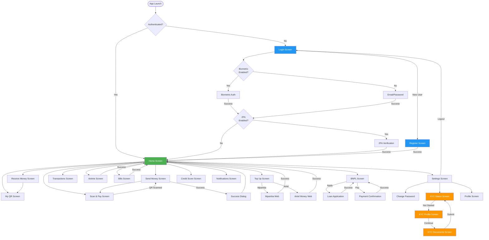

## Authentication Flow Detail

```plantuml
@startuml AuthenticationFlow

start

:App Launch;

if (Has Valid Token?) then (yes)
  :Navigate to Home;
  stop
else (no)
  :Show Login Screen;
endif

partition "Login Options" {
  if (User Selection?) then (Email/Password)
    :Enter Email;
    :Enter Password;
    :Tap Login;

    if (Credentials Valid?) then (yes)
      if (2FA Enabled?) then (yes)
        :Generate 2FA Code;
        :Send SMS;
        :Show 2FA Input;
        :User Enters Code;

        if (Code Valid?) then (yes)
          :Generate JWT Token;
          :Navigate to Home;
          stop
        else (no)
          :Show Error;
          stop
        endif
      else (no)
        :Generate JWT Token;
        :Navigate to Home;
        stop
      endif
    else (no)
      :Show "Invalid Credentials";
      stop
    endif

  elseif (Biometric) then
    if (Biometric Available?) then (yes)
      :Show Biometric Prompt;
      :User Provides Biometric;

      if (Verified?) then (yes)
        :Retrieve Saved Credentials;
        :Auto Login;
        :Navigate to Home;
        stop
      else (no)
        :Show Error;
        stop
      endif
    else (no)
      :Show "Not Available";
      stop
    endif

  else (Google OAuth)
    :Redirect to Google;
    :User Authorizes;

    if (Authorized?) then (yes)
      :Retrieve User Info;

      if (Account Exists?) then (yes)
        :Login User;
      else (no)
        :Create Account;
      endif

      :Generate JWT Token;
      :Navigate to Home;
      stop
    else (no)
      :Show Error;
      stop
    endif

  else (Register)
    :Navigate to Register;
    stop
  endif
}

@enduml
```

## Money Transfer Flow

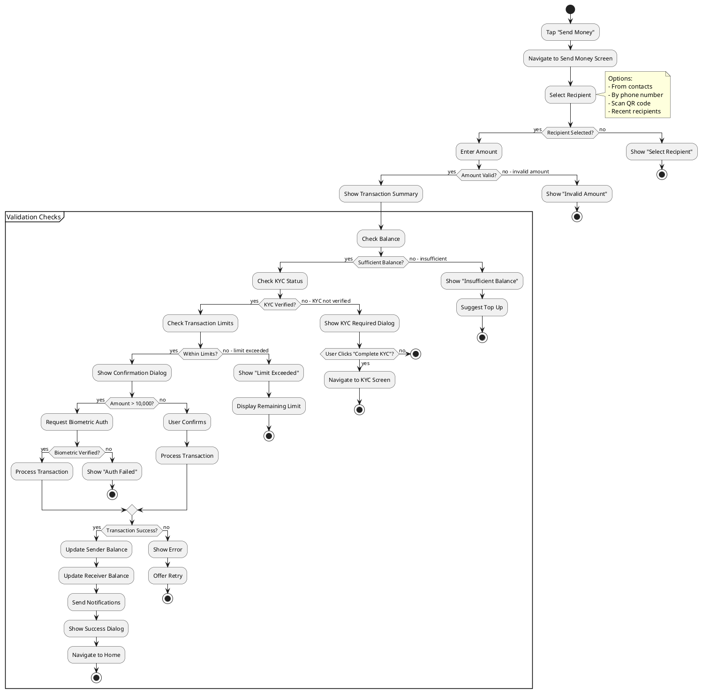

## KYC Verification Flow

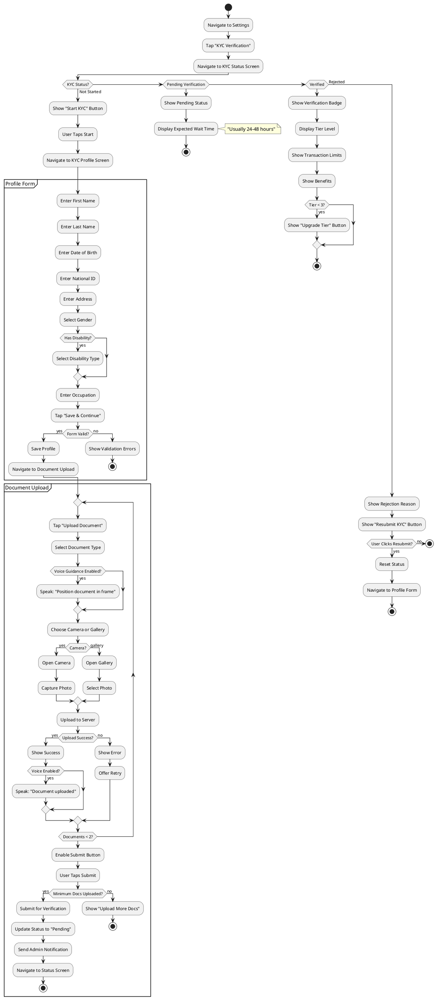

## BNPL Loan Flow

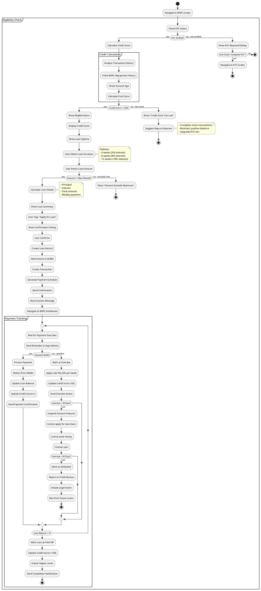

## Voice Command Flow

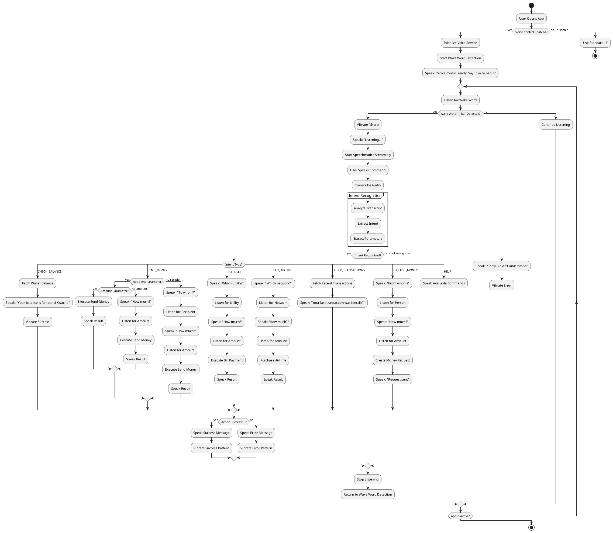

## Settings & Profile Flow

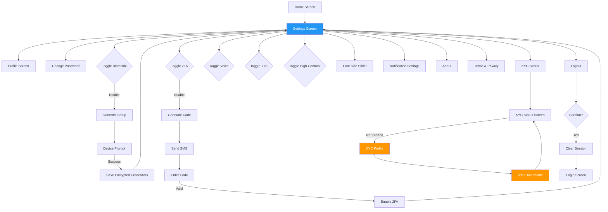

## Transaction History Flow

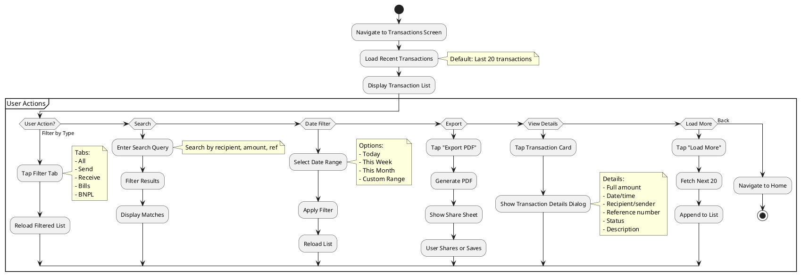

## Notification Flow

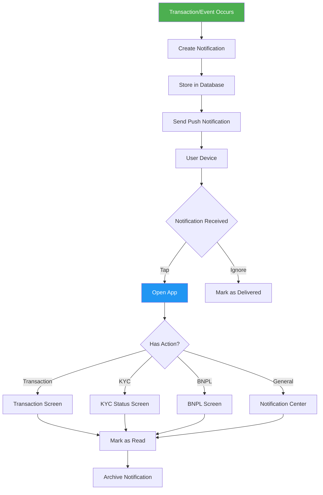

## Error Handling Flow

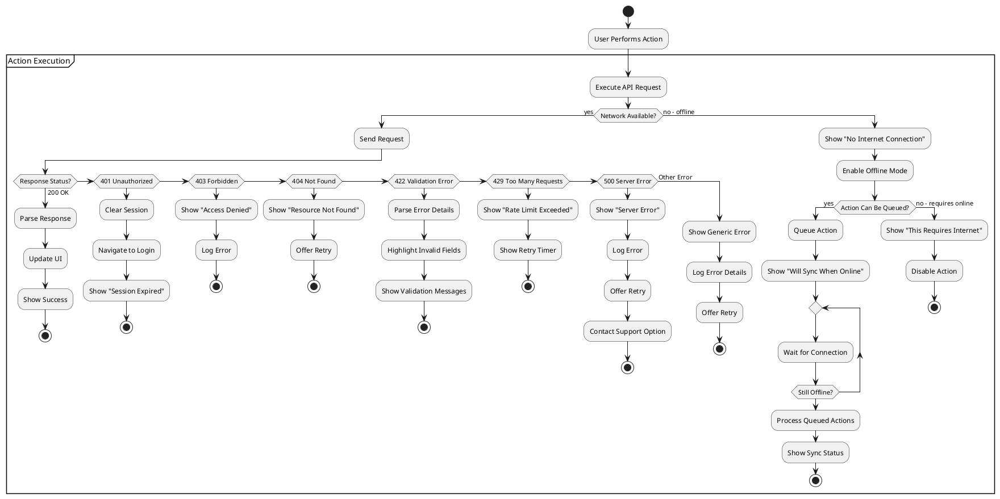

---

## Deep Link Flows

### Push Notification Deep Links

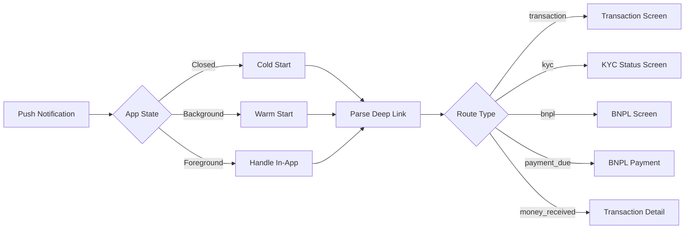

### QR Code Flows

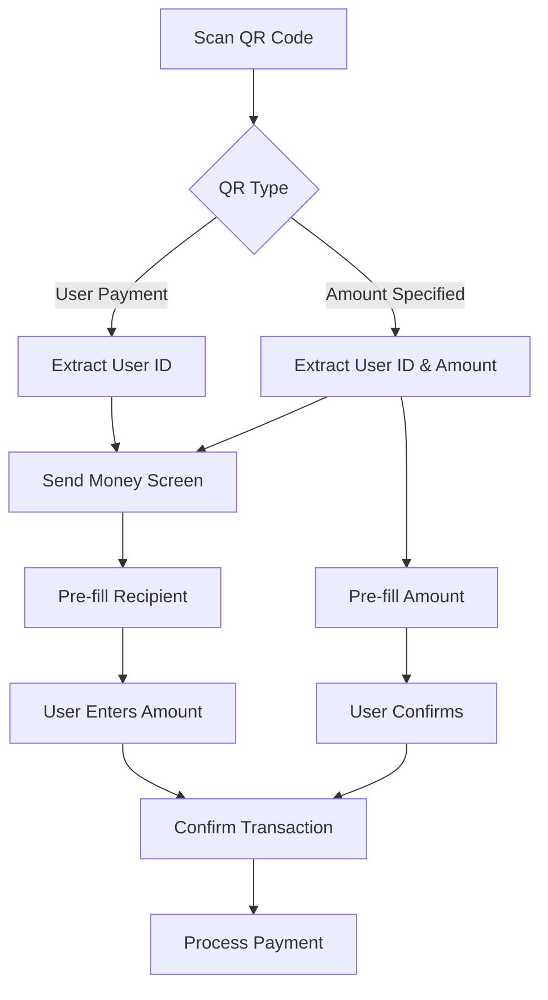
