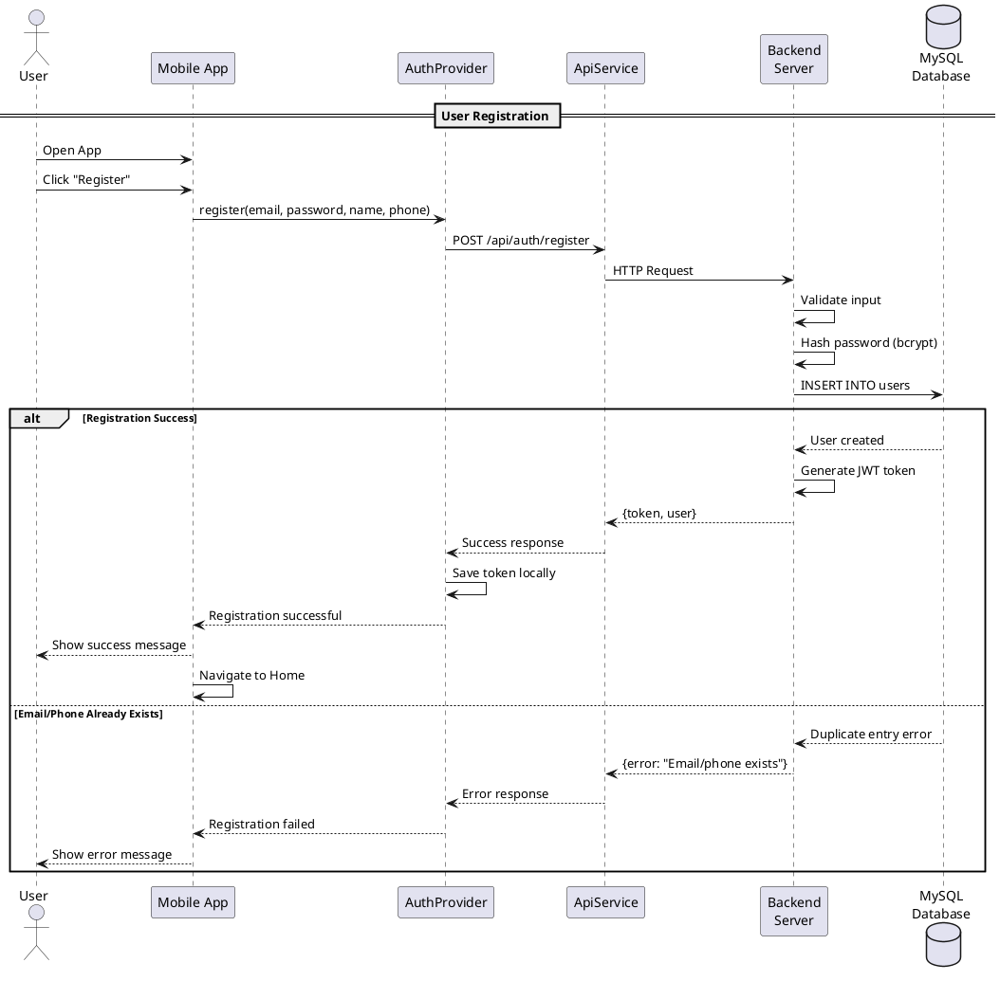
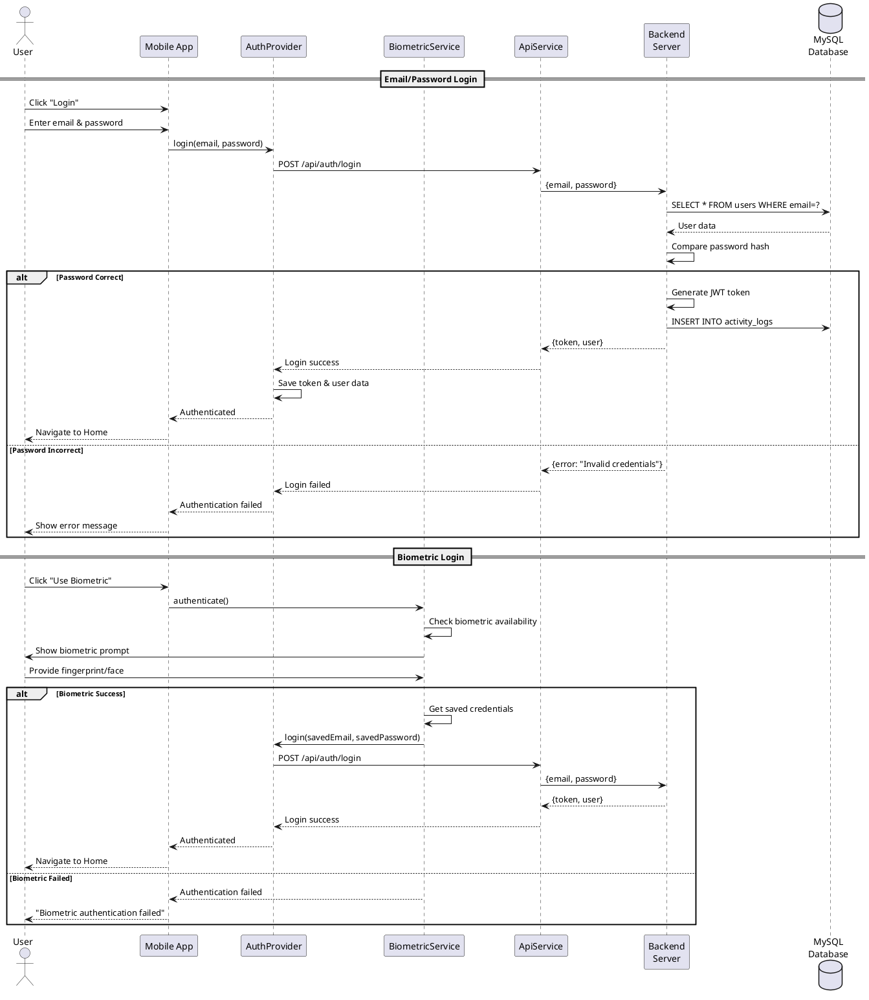
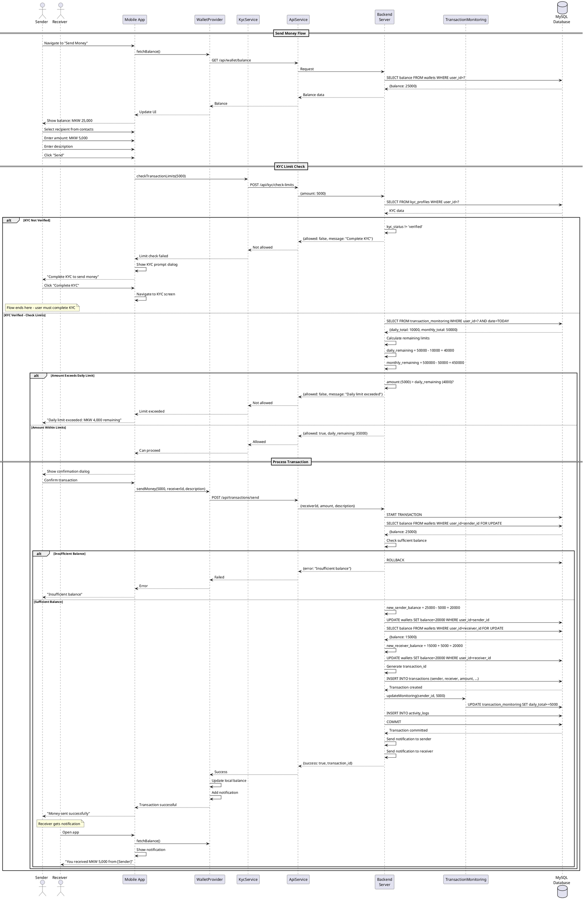
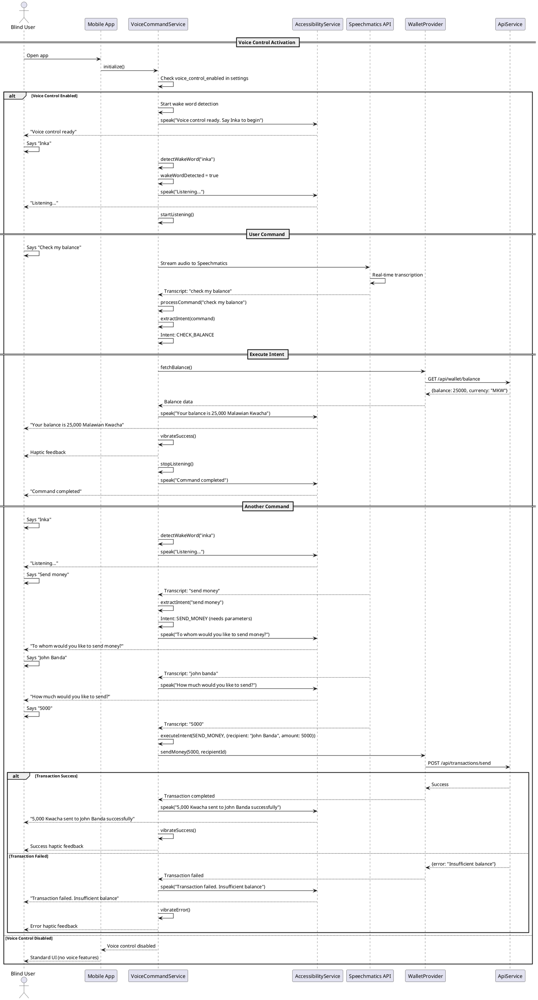
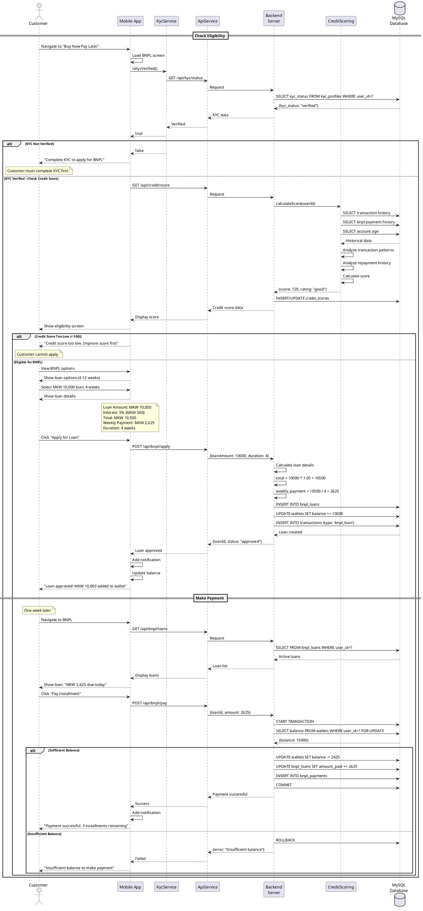
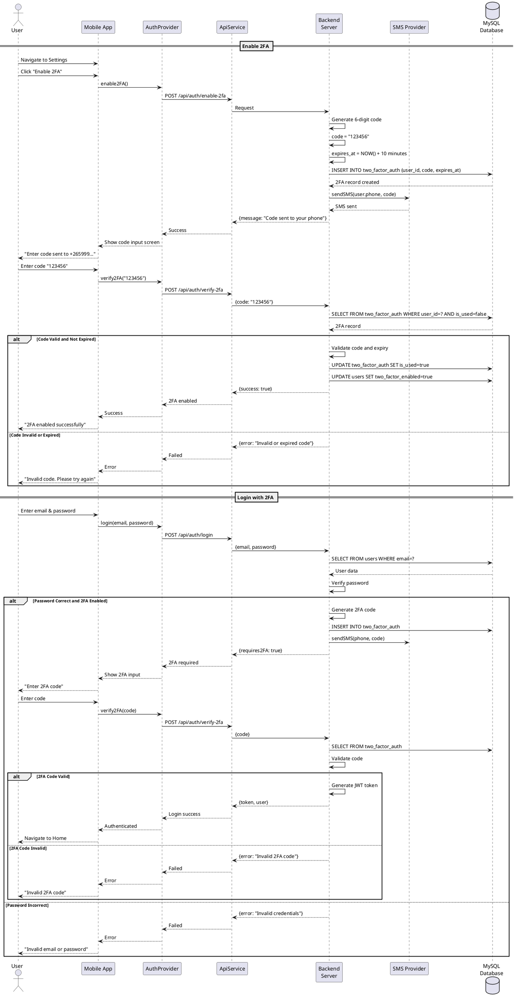

# InkaWallet Sequence Diagrams

## User Registration and Login Flow

## KYC Verification Flow

```plantuml
@startuml KYCVerification

actor Customer
actor Admin
participant "Mobile App" as App
participant "KycService" as KYC
participant "ApiService" as API
participant "Backend\nServer" as Server
participant "File Storage" as Storage
database "MySQL\nDatabase" as DB

== Customer Submits KYC ==

Customer -> App: Navigate to Settings
Customer -> App: Click "KYC Verification"
App -> App: Show KYC Status Screen

App -> KYC: getKycStatus()
KYC -> API: GET /api/kyc/status
API -> Server: Request
Server -> DB: SELECT FROM kyc_profiles WHERE user_id=?
DB --> Server: KYC data or null
Server --> API: {kyc_status: "not_started"}
API --> KYC: Status data
KYC --> App: Display status
App --> Customer: Show "Start KYC" button

Customer -> App: Click "Start KYC"
App -> App: Navigate to KYC Profile Screen

Customer -> App: Fill personal information
Customer -> App: Enter ID numbers
Customer -> App: Declare disability (if applicable)
Customer -> App: Click "Save & Continue"

App -> API: POST /api/kyc/profile
API -> Server: {firstName, lastName, nationalId, ...}

Server -> Server: Validate required fields
Server -> Server: Check ID uniqueness
Server -> DB: INSERT INTO kyc_profiles

alt Profile Created
    DB --> Server: Profile ID
    Server -> DB: INSERT INTO kyc_verification_history
    Server --> API: {message: "Profile saved"}
    API --> App: Success
    App -> App: Navigate to Document Upload
else Duplicate ID
    DB --> Server: Error: Duplicate entry
    Server --> API: {error: "ID already registered"}
    API --> App: Error
    App --> Customer: "This ID is already registered"
end

== Document Upload ==

Customer -> App: Click "Upload National ID"
App -> App: Show camera/gallery options
Customer -> App: Select camera

App -> App: Open camera
App -> Customer: Voice: "Position ID in frame"
Customer -> App: Take photo
App -> Customer: Voice: "Document captured"

App -> API: POST /api/kyc/documents (multipart/form-data)
API -> Server: File + document_type

Server -> Server: Validate file type & size
Server -> Storage: Save file
Storage --> Server: File path

Server -> DB: INSERT INTO kyc_documents
DB --> Server: Document ID
Server --> API: {message: "Document uploaded"}
API --> App: Success
App --> Customer: "Upload successful"

Customer -> App: Upload selfie
Customer -> App: Upload proof of address
App -> Customer: "Minimum documents uploaded"

Customer -> App: Click "Submit for Verification"
App -> API: POST /api/kyc/submit
API -> Server: Submit request

Server -> DB: SELECT documents count FROM kyc_documents
DB --> Server: Document count

alt Sufficient Documents (>= 2)
    Server -> DB: UPDATE kyc_profiles SET status='pending_verification'
    Server -> DB: INSERT INTO kyc_verification_history
    Server --> API: {message: "Submitted. Review in 24-48h"}
    API --> App: Success
    App --> Customer: "KYC submitted successfully"
else Insufficient Documents
    Server --> API: {error: "Upload at least 2 documents"}
    API --> App: Error
    App --> Customer: "Please upload more documents"
end

== Admin Verification ==

Admin -> App: Login as admin
Admin -> App: Navigate to Admin Panel
App -> API: GET /api/kyc/admin/pending
API -> Server: Request

Server -> DB: SELECT FROM kyc_profiles WHERE status='pending_verification'
DB --> Server: Pending KYC list
Server --> API: [pending KYC profiles]
API --> App: Display list
App --> Admin: Show pending verifications

Admin -> App: Select KYC profile
App --> Admin: Show profile details & documents

Admin -> Admin: Review documents
Admin -> Admin: Verify identity
Admin -> Admin: Check AML/CFT rules

alt Approve KYC
    Admin -> App: Click "Approve"
    Admin -> App: Select tier (Tier 1)
    App -> API: PUT /api/kyc/admin/verify/:id
    API -> Server: {action: "verify", tier: "tier1", limits}

    Server -> DB: UPDATE kyc_profiles SET status='verified', tier='tier1'
    Server -> DB: INSERT INTO kyc_verification_history
    Server -> DB: SELECT user FROM users WHERE id=?
    DB --> Server: User data
    Server -> Server: Send notification to user
    Server --> API: {message: "KYC verified"}
    API --> App: Success
    App --> Admin: "KYC approved"

    note over Customer: Customer receives notification
    Customer -> App: Check notification
    App -> KYC: getKycStatus()
    KYC -> API: GET /api/kyc/status
    API -> Server: Request
    Server -> DB: SELECT FROM kyc_profiles
    DB --> Server: {status: "verified", tier: "tier1"}
    Server --> API: Status data
    API --> App: Display
    App --> Customer: "KYC Verified! ✓"

else Reject KYC
    Admin -> App: Click "Reject"
    Admin -> App: Enter rejection reason
    App -> API: PUT /api/kyc/admin/verify/:id
    API -> Server: {action: "reject", reason}

    Server -> DB: UPDATE kyc_profiles SET status='rejected'
    Server -> DB: INSERT INTO kyc_verification_history
    Server --> API: {message: "KYC rejected"}
    API --> App: Success
    App --> Admin: "KYC rejected"

    note over Customer: Customer receives notification
    Customer -> App: Check status
    App --> Customer: "KYC Rejected. Please resubmit"
end

@enduml
```

## Send Money Transaction Flow

## Voice Command Flow

## BNPL Loan Application Flow

## 2FA Authentication Flow

