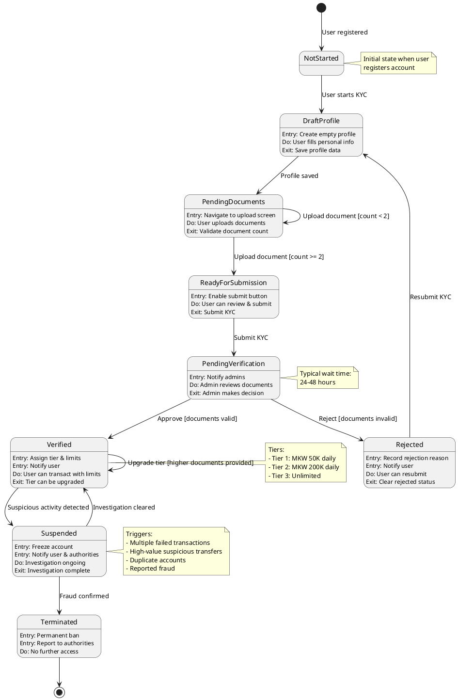
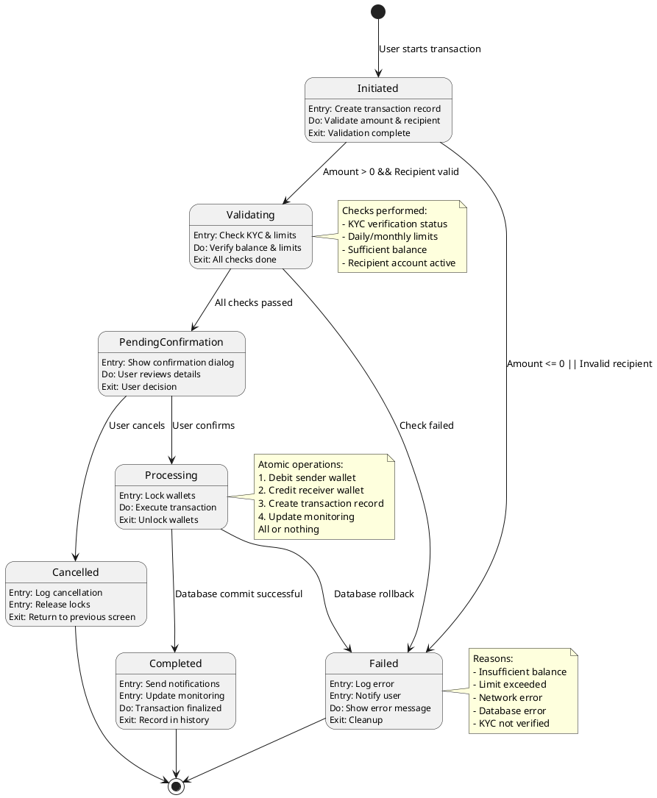
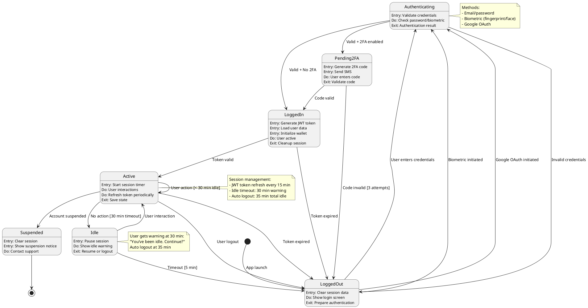
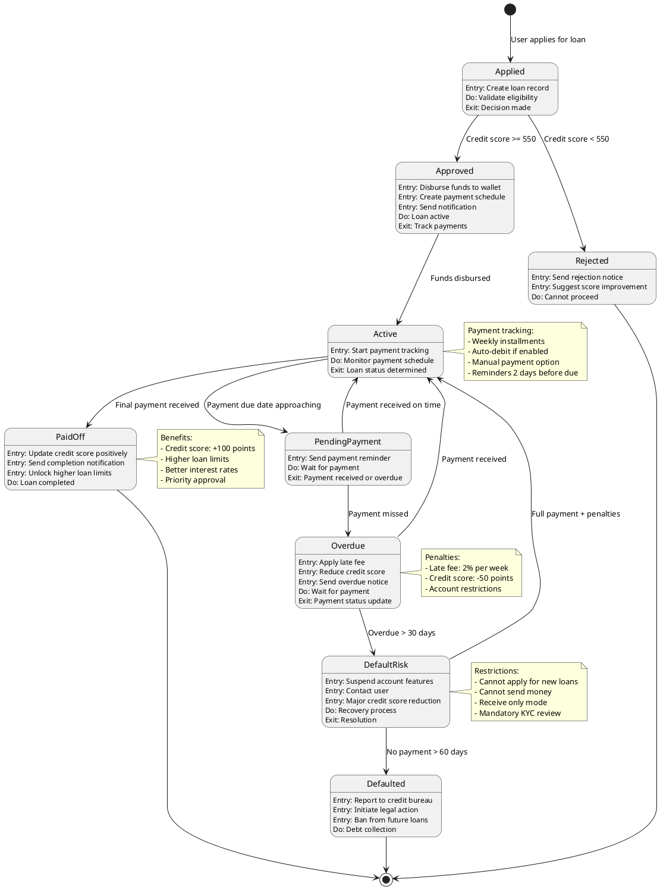
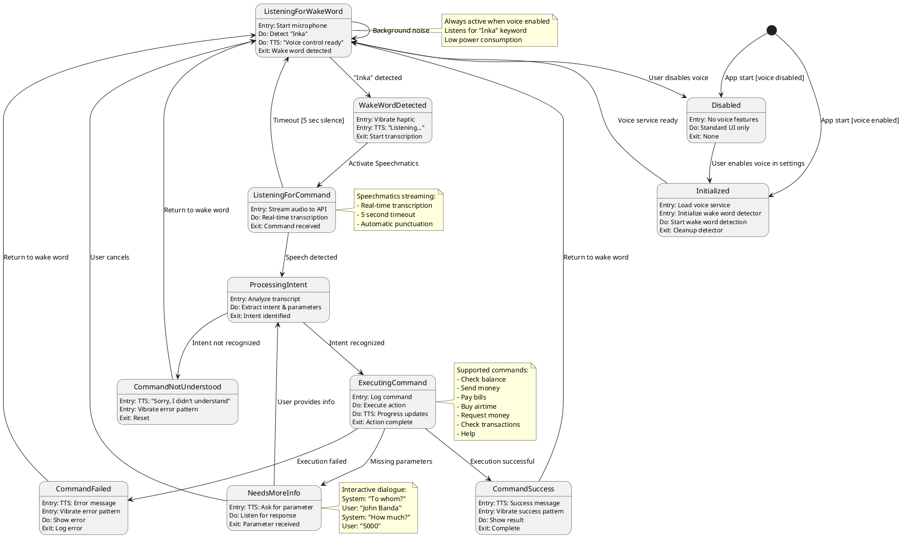
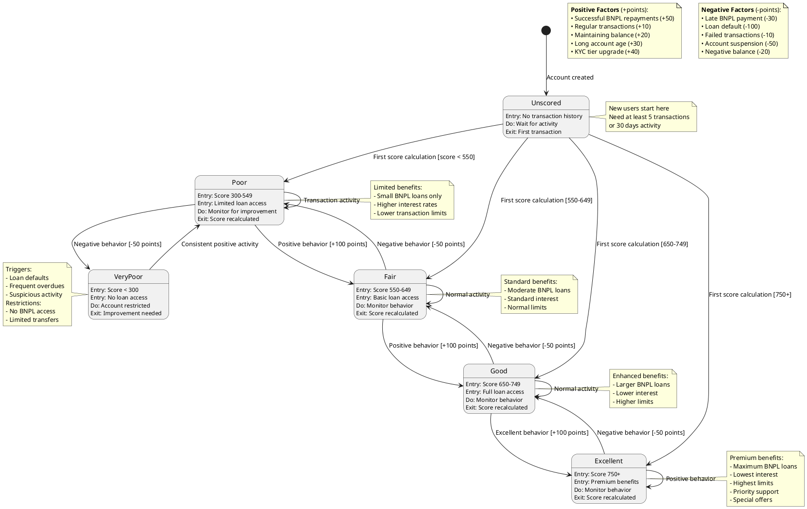
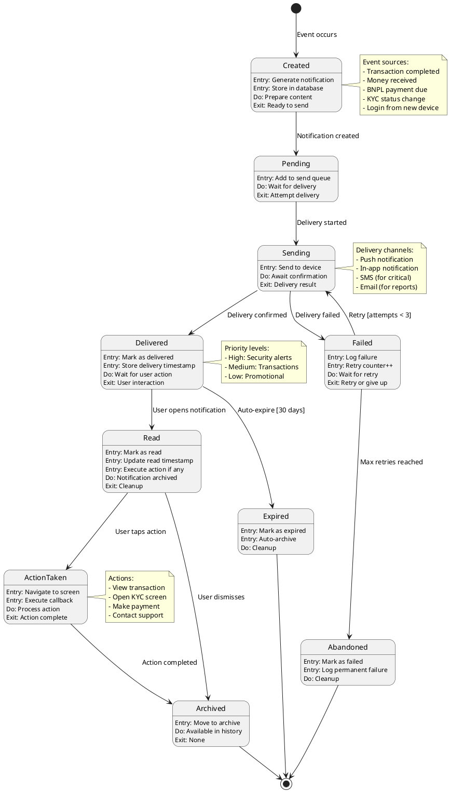

# InkaWallet State Diagrams

## KYC Profile State Diagram

## Transaction State Diagram

## User Session State Diagram

## BNPL Loan State Diagram

## Voice Control State Diagram

## Credit Score State Diagram

## Notification State Diagram

