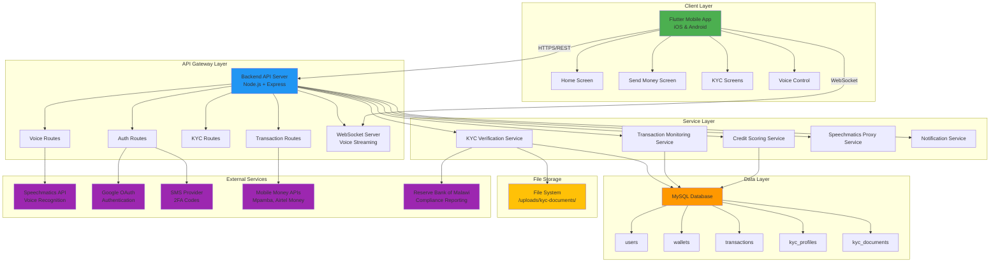
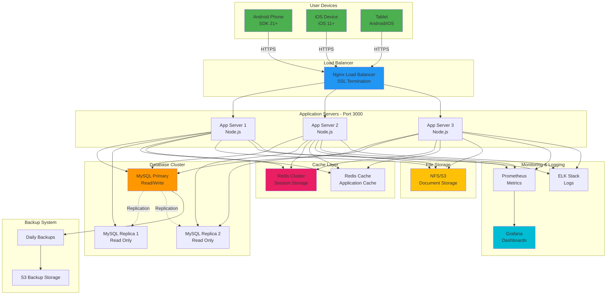
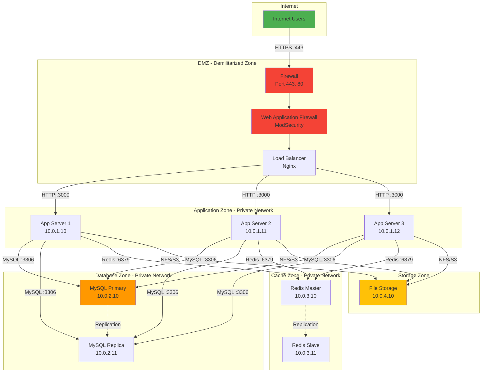
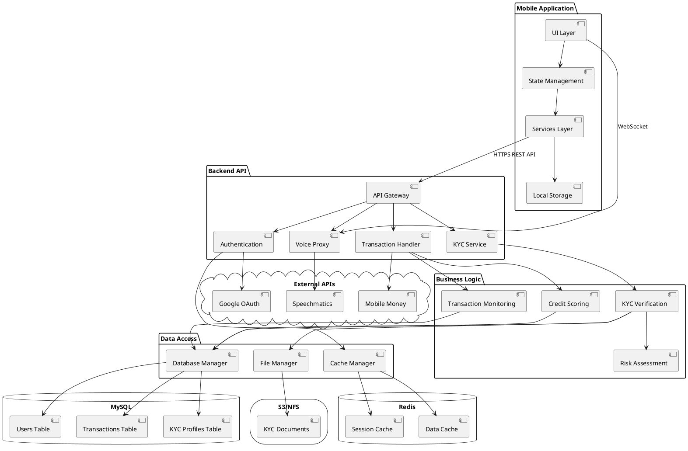
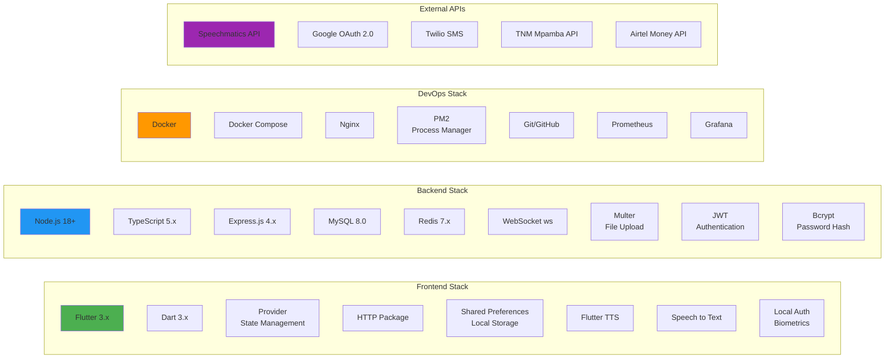
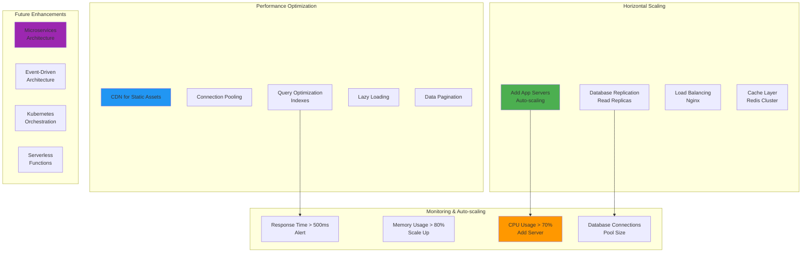

# InkaWallet System Architecture & Deployment Diagrams

## System Architecture Diagram



## Deployment Architecture



## Infrastructure Diagram

```plantuml
@startuml Infrastructure

!define DEVICONS https://raw.githubusercontent.com/tupadr3/plantuml-icon-font-sprites/master/devicons
!define FONTAWESOME https://raw.githubusercontent.com/tupadr3/plantuml-icon-font-sprites/master/font-awesome-5

!include DEVICONS/android.puml
!include DEVICONS/apple.puml
!include DEVICONS/nginx.puml
!include DEVICONS/nodejs.puml
!include DEVICONS/mysql.puml
!include DEVICONS/redis.puml

package "Mobile Clients" {
    DEV_ANDROID(android, "Android App", component)
    DEV_APPLE(ios, "iOS App", component)
}

package "Edge Layer" {
    DEV_NGINX(nginx, "Nginx LB\nSSL/TLS", component)
}

package "Application Layer" {
    DEV_NODEJS(node1, "Node.js\nServer 1", component)
    DEV_NODEJS(node2, "Node.js\nServer 2", component)
    DEV_NODEJS(node3, "Node.js\nServer 3", component)
}

package "Data Layer" {
    DEV_MYSQL(mysql_primary, "MySQL\nPrimary", database)
    DEV_MYSQL(mysql_replica1, "MySQL\nReplica 1", database)
    DEV_MYSQL(mysql_replica2, "MySQL\nReplica 2", database)
}

package "Cache Layer" {
    DEV_REDIS(redis_session, "Redis\nSessions", component)
    DEV_REDIS(redis_cache, "Redis\nCache", component)
}

cloud "External Services" {
    [Speechmatics API]
    [Google OAuth]
    [SMS Gateway]
    [Mobile Money APIs]
}

storage "File Storage" {
    [S3/NFS\nKYC Documents]
}

android -down-> nginx : HTTPS
ios -down-> nginx : HTTPS

nginx -down-> node1 : HTTP
nginx -down-> node2 : HTTP
nginx -down-> node3 : HTTP

node1 -down-> mysql_primary : Write
node2 -down-> mysql_primary : Write
node3 -down-> mysql_primary : Write

node1 -down-> mysql_replica1 : Read
node2 -down-> mysql_replica2 : Read
node3 -down-> mysql_replica1 : Read

mysql_primary .down.> mysql_replica1 : Replicate
mysql_primary .down.> mysql_replica2 : Replicate

node1 -right-> redis_session
node2 -right-> redis_session
node3 -right-> redis_session

node1 -right-> redis_cache
node2 -right-> redis_cache
node3 -right-> redis_cache

node1 --> [Speechmatics API]
node2 --> [Google OAuth]
node3 --> [SMS Gateway]
node1 --> [Mobile Money APIs]

node1 --> [S3/NFS\nKYC Documents]
node2 --> [S3/NFS\nKYC Documents]
node3 --> [S3/NFS\nKYC Documents]

@enduml
```

## Network Architecture



## Component Diagram



## Technology Stack



## Security Architecture

```plantuml
@startuml SecurityArchitecture

actor User
participant "Mobile App" as App
participant "WAF" as WAF
participant "Load Balancer" as LB
participant "API Server" as API
participant "Auth Service" as Auth
database "Database" as DB
storage "File Storage" as Storage

== Security Layers ==

User -> App: Launch App
App -> App: Check SSL Certificate Pinning

App -> WAF: HTTPS Request (TLS 1.3)
WAF -> WAF: DDoS Protection
WAF -> WAF: SQL Injection Check
WAF -> WAF: XSS Protection
WAF -> LB: Forward Request

LB -> API: HTTP Request
API -> Auth: Verify JWT Token

Auth -> Auth: Validate Token Signature
Auth -> Auth: Check Token Expiry
Auth -> Auth: Verify IP Address

alt Valid Token
    Auth --> API: Authorized
    API -> API: Rate Limiting Check
    API -> API: Input Validation
    API -> API: Sanitize Input

    API -> DB: Encrypted Query (SSL)
    DB -> DB: Row-Level Security
    DB --> API: Encrypted Data

    API -> API: Encrypt Sensitive Data (AES-256)
    API --> LB: Response
    LB --> WAF: Response
    WAF --> App: HTTPS Response

else Invalid Token
    Auth --> API: Unauthorized
    API --> LB: 401 Error
    LB --> WAF: Error
    WAF --> App: Unauthorized
end

== File Upload Security ==

User -> App: Upload KYC Document
App -> App: Virus Scan (Local)
App -> App: File Type Validation
App -> API: Encrypted Upload

API -> API: Validate File Type
API -> API: Check File Size
API -> API: Scan for Malware
API -> Storage: Store with Encryption
Storage -> Storage: AES-256 Encryption
Storage --> API: File URL (Signed)

== Data Protection ==

note over DB
    - All passwords hashed (bcrypt)
    - PII encrypted (AES-256)
    - SSL/TLS connections
    - Backup encryption
    - Access logs
end note

note over API
    - JWT token auth
    - Rate limiting
    - Input validation
    - CORS protection
    - Helmet.js security headers
end note

note over App
    - SSL pinning
    - Secure storage
    - Code obfuscation
    - Root/jailbreak detection
    - Biometric encryption
end note

@enduml
```

## Scalability Strategy


