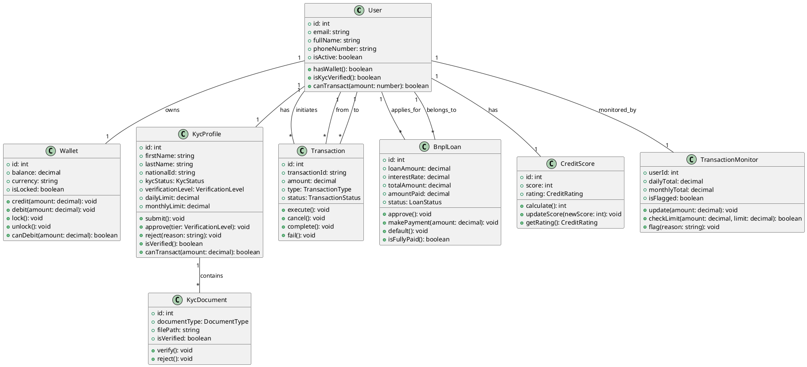

# InkaWallet UML Class Diagrams

## System Architecture Class Diagram

```plantuml
@startuml InkaWallet_Architecture

package "Mobile App (Flutter)" {

  package "Screens" {
    class HomeScreen {
      +build(): Widget
      +showBalance: bool
      +toggleBalance()
    }

    class LoginScreen {
      +emailController: TextEditingController
      +passwordController: TextEditingController
      +login()
      +loginWithGoogle()
      +loginWithBiometric()
    }

    class SendMoneyScreen {
      +amountController: TextEditingController
      +recipientController: TextEditingController
      +selectedBank: String
      +sendMoney()
      +selectRecipient()
    }

    class KycProfileScreen {
      +formKey: GlobalKey
      +firstNameController: TextEditingController
      +lastNameController: TextEditingController
      +saveProfile()
      +uploadDocuments()
    }

    class KycStatusScreen {
      +kycStatus: String
      +verificationLevel: String
      +dailyLimit: double
      +checkStatus()
    }
  }

  package "Providers (State Management)" {
    class AuthProvider {
      -_isAuthenticated: bool
      -_user: User
      -_token: String
      +login(email, password)
      +register(userData)
      +logout()
      +checkAuth()
    }

    class WalletProvider {
      -_balance: double
      -_currency: String
      -_transactions: List<Transaction>
      +fetchBalance()
      +sendMoney(amount, recipient)
      +receiveMoney(amount, sender)
      +fetchTransactions()
    }

    class ThemeProvider {
      -_isDarkMode: bool
      +toggleTheme()
      +lightTheme: ThemeData
      +darkTheme: ThemeData
    }
  }

  package "Services" {
    class ApiService {
      -baseUrl: String
      -httpClient: http.Client
      +get(endpoint): Future<Response>
      +post(endpoint, data): Future<Response>
      +put(endpoint, data): Future<Response>
      +delete(endpoint): Future<Response>
    }

    class KycService {
      +checkTransactionLimits(amount): Future<Map>
      +getKycStatus(): Future<Map>
      +isKycVerified(): Future<bool>
      +getTransactionLimits(): Future<Map>
    }

    class AccessibilityService {
      +isVoiceEnabled: bool
      +isHapticsEnabled: bool
      +speak(text)
      +vibrate()
      +initialize()
    }

    class VoiceCommandService {
      +isListening: bool
      +recognizedText: String
      +startListening()
      +stopListening()
      +processCommand(command)
    }

    class BiometricService {
      +isEnabled: bool
      +checkAvailability(): Future<bool>
      +authenticate(): Future<bool>
      +enableBiometric()
    }

    class NotificationService {
      -_notifications: List<Notification>
      +addNotification(title, message, type)
      +getNotifications(): List<Notification>
      +markAsRead(id)
      +deleteNotification(id)
    }
  }

  package "Models" {
    class User {
      +id: int
      +email: String
      +fullName: String
      +phoneNumber: String
      +isAccessibilityEnabled: bool
      +isVoiceEnabled: bool
    }

    class Wallet {
      +id: int
      +userId: int
      +balance: double
      +currency: String
      +isLocked: bool
    }

    class Transaction {
      +id: int
      +transactionId: String
      +senderId: int
      +receiverId: int
      +amount: double
      +type: TransactionType
      +status: TransactionStatus
      +createdAt: DateTime
    }

    class KycProfile {
      +id: int
      +userId: int
      +firstName: String
      +lastName: String
      +nationalId: String
      +kycStatus: KycStatus
      +verificationLevel: VerificationLevel
      +dailyLimit: double
      +monthlyLimit: double
    }
  }
}

package "Backend (Node.js/TypeScript)" {

  package "Routes" {
    class AuthRoutes {
      +router: Router
      +register(req, res)
      +login(req, res)
      +googleAuth(req, res)
      +logout(req, res)
    }

    class KycRoutes {
      +router: Router
      +getProfile(req, res)
      +createProfile(req, res)
      +uploadDocument(req, res)
      +submitForVerification(req, res)
      +checkLimits(req, res)
      +adminVerify(req, res)
    }

    class TransactionRoutes {
      +router: Router
      +sendMoney(req, res)
      +receiveMoney(req, res)
      +getHistory(req, res)
    }

    class WalletRoutes {
      +router: Router
      +getBalance(req, res)
      +topUp(req, res)
    }
  }

  package "Middleware" {
    class AuthMiddleware {
      +authenticateToken(req, res, next)
      +isAdmin(req, res, next)
    }

    class ValidationMiddleware {
      +validateTransaction(req, res, next)
      +validateKycProfile(req, res, next)
    }
  }

  package "Services" {
    class SpeechmaticsProxyService {
      -apiKey: String
      -wsConnection: WebSocket
      +handleConnection(ws, req)
      +processAudio(audioData)
      +sendTranscript(text)
    }

    class KycVerificationService {
      +verifyDocument(documentId): Promise<bool>
      +calculateRiskRating(userId): Promise<RiskRating>
      +setTransactionLimits(userId, tier)
    }

    class TransactionMonitoringService {
      +checkDailyLimit(userId, amount): Promise<bool>
      +checkMonthlyLimit(userId, amount): Promise<bool>
      +flagSuspiciousActivity(transactionId)
      +updateMonitoring(userId, amount)
    }
  }

  package "Database" {
    class DatabaseConfig {
      +host: String
      +port: int
      +user: String
      +password: String
      +database: String
      +pool: ConnectionPool
      +query(sql, params): Promise<Result>
    }
  }
}

package "External Services" {
  class SpeechmaticsAPI {
    +transcribe(audio): String
    +realTimeTranscription(stream)
  }

  class GoogleOAuth {
    +authenticate(token): UserInfo
  }

  class SMSProvider {
    +send2FACode(phone, code)
  }

  class PaymentGateway {
    +processMobileMoneyPayment(amount, phone)
    +processBankTransfer(amount, accountNo)
  }
}

' Mobile App Relationships
HomeScreen --> WalletProvider : uses
HomeScreen --> NotificationService : uses
LoginScreen --> AuthProvider : uses
LoginScreen --> BiometricService : uses
SendMoneyScreen --> WalletProvider : uses
SendMoneyScreen --> KycService : checks limits
KycProfileScreen --> ApiService : submits profile
KycStatusScreen --> KycService : checks status

AuthProvider --> ApiService : makes requests
WalletProvider --> ApiService : makes requests
VoiceCommandService --> AccessibilityService : uses

User "1" -- "1" Wallet
User "1" -- "1" KycProfile
User "1" -- "*" Transaction

' Backend Relationships
AuthRoutes --> AuthMiddleware : uses
KycRoutes --> AuthMiddleware : uses
KycRoutes --> KycVerificationService : uses
TransactionRoutes --> TransactionMonitoringService : uses
TransactionRoutes --> KycVerificationService : checks limits

KycVerificationService --> DatabaseConfig : queries
TransactionMonitoringService --> DatabaseConfig : queries

' External Service Relationships
VoiceCommandService --> SpeechmaticsAPI : transcribes
AuthProvider --> GoogleOAuth : authenticates
AuthRoutes --> SMSProvider : sends 2FA
WalletProvider --> PaymentGateway : processes payments

@enduml
```

## Mobile App Class Diagram (Detailed)

```plantuml
@startuml MobileApp_Classes

package "lib/providers" {

  class AuthProvider extends ChangeNotifier {
    -_isAuthenticated: bool
    -_user: User?
    -_token: String?
    -_apiService: ApiService

    +isAuthenticated: bool
    +user: User?
    +token: String?

    +login(email: String, password: String): Future<bool>
    +register(userData: Map): Future<bool>
    +loginWithGoogle(googleToken: String): Future<bool>
    +logout(): Future<void>
    +checkAuth(): Future<void>
    +enable2FA(): Future<bool>
    +verify2FA(code: String): Future<bool>
    -_saveToken(token: String): Future<void>
    -_clearToken(): Future<void>
  }

  class WalletProvider extends ChangeNotifier {
    -_balance: double
    -_currency: String
    -_transactions: List<Transaction>
    -_apiService: ApiService
    -_notificationService: NotificationService

    +balance: double
    +currency: String
    +transactions: List<Transaction>

    +fetchBalance(): Future<void>
    +sendMoney(amount: double, recipientId: int): Future<bool>
    +receiveMoney(amount: double, senderId: int): Future<bool>
    +topUpWallet(amount: double, method: String): Future<bool>
    +fetchTransactions(): Future<void>
    +buyAirtime(phone: String, amount: double): Future<bool>
    +payBill(billType: String, amount: double): Future<bool>
    -_updateBalance(newBalance: double): void
    -_addTransaction(transaction: Transaction): void
  }

  class ThemeProvider extends ChangeNotifier {
    -_isDarkMode: bool
    -_preferences: SharedPreferences

    +isDarkMode: bool
    +lightTheme: ThemeData
    +darkTheme: ThemeData

    +toggleTheme(): Future<void>
    +setDarkMode(enabled: bool): Future<void>
    -_loadThemePreference(): Future<void>
    -_saveThemePreference(): Future<void>
  }
}

package "lib/services" {

  class ApiService {
    -baseUrl: String
    -httpClient: http.Client
    -_token: String?

    +setToken(token: String): void
    +get(endpoint: String): Future<Response>
    +post(endpoint: String, data: Map): Future<Response>
    +put(endpoint: String, data: Map): Future<Response>
    +delete(endpoint: String): Future<Response>
    +upload(endpoint: String, file: File): Future<Response>
    -_getHeaders(): Map<String, String>
    -_handleError(error: dynamic): void
  }

  class KycService {
    -apiService: ApiService

    +checkTransactionLimits(amount: double): Future<Map<String, dynamic>>
    +getKycStatus(): Future<Map<String, dynamic>?>
    +isKycVerified(): Future<bool>
    +getVerificationLevel(): Future<String?>
    +getTransactionLimits(): Future<Map<String, double>?>
    +submitKycProfile(profileData: Map): Future<bool>
    +uploadDocument(file: File, type: String): Future<bool>
  }

  class AccessibilityService {
    -_tts: FlutterTts
    -_preferences: SharedPreferences

    +isAccessibilityEnabled: bool
    +isVoiceEnabled: bool
    +isHapticsEnabled: bool
    +isVoiceControlEnabled: bool

    +initialize(): Future<void>
    +speak(text: String): Future<void>
    +stopSpeaking(): Future<void>
    +vibrate(): Future<void>
    +updateSettings(settings: Map): Future<void>
    -_loadSettings(): Future<void>
  }

  class VoiceCommandService {
    -_speech: SpeechToText
    -_speechmatics: WebSocket
    -_accessibilityService: AccessibilityService

    +isListening: bool
    +recognizedText: String
    +wakeWordDetected: bool

    +initialize(): Future<void>
    +startListening(): Future<void>
    +stopListening(): Future<void>
    +processCommand(command: String): Future<void>
    +detectWakeWord(text: String): bool
    -_extractIntent(command: String): Intent
    -_executeIntent(intent: Intent): Future<void>
    +vibrateSuccess(): Future<void>
    +vibrateError(): Future<void>
    +vibrateConfirmation(): Future<void>
  }

  class BiometricService {
    -_localAuth: LocalAuthentication
    -_preferences: SharedPreferences

    +isEnabled: bool
    +biometricType: BiometricType?

    +checkAvailability(): Future<bool>
    +authenticate(): Future<bool>
    +enableBiometric(): Future<bool>
    +disableBiometric(): Future<void>
    -_canCheckBiometrics(): Future<bool>
    -_getAvailableBiometrics(): Future<List<BiometricType>>
  }

  class NotificationService {
    -_notifications: List<NotificationModel>
    -_preferences: SharedPreferences

    +notifications: List<NotificationModel>
    +unreadCount: int

    +initialize(): Future<void>
    +addNotification(title: String, message: String, type: String): Future<void>
    +getNotifications(): List<NotificationModel>
    +markAsRead(id: String): Future<void>
    +deleteNotification(id: String): Future<void>
    +clearAll(): Future<void>
    -_saveNotifications(): Future<void>
    -_loadNotifications(): Future<void>
  }
}

package "lib/models" {

  class User {
    +id: int
    +email: String
    +fullName: String
    +phoneNumber: String
    +googleId: String?
    +isAccessibilityEnabled: bool
    +isVoiceEnabled: bool
    +isHapticsEnabled: bool
    +isBiometricEnabled: bool
    +isAdmin: bool
    +isActive: bool
    +createdAt: DateTime

    +toJson(): Map<String, dynamic>
    +fromJson(json: Map): User
  }

  class Wallet {
    +id: int
    +userId: int
    +balance: double
    +currency: String
    +isLocked: bool
    +createdAt: DateTime

    +toJson(): Map<String, dynamic>
    +fromJson(json: Map): Wallet
  }

  class Transaction {
    +id: int
    +transactionId: String
    +senderId: int
    +receiverId: int
    +amount: double
    +type: TransactionType
    +description: String
    +paymentMethod: PaymentMethod
    +status: TransactionStatus
    +createdAt: DateTime

    +toJson(): Map<String, dynamic>
    +fromJson(json: Map): Transaction
  }

  class KycProfile {
    +id: int
    +userId: int
    +firstName: String
    +lastName: String
    +dateOfBirth: DateTime
    +gender: Gender
    +nationalId: String
    +address: String
    +city: String
    +district: String
    +region: Region
    +kycStatus: KycStatus
    +verificationLevel: VerificationLevel
    +dailyLimit: double
    +monthlyLimit: double
    +hasDisability: bool
    +disabilityType: DisabilityType
    +preferredCommunication: CommunicationType

    +toJson(): Map<String, dynamic>
    +fromJson(json: Map): KycProfile
  }

  class NotificationModel {
    +id: String
    +title: String
    +message: String
    +type: String
    +timestamp: DateTime
    +isRead: bool
    +data: Map?

    +toJson(): Map<String, dynamic>
    +fromJson(json: Map): NotificationModel
  }

  enum TransactionType {
    SEND_MONEY
    RECEIVE_MONEY
    DEPOSIT
    WITHDRAWAL
    AIRTIME
    BILL_PAYMENT
    BNPL_PAYMENT
  }

  enum TransactionStatus {
    PENDING
    COMPLETED
    FAILED
    CANCELLED
  }

  enum KycStatus {
    NOT_STARTED
    INCOMPLETE
    PENDING_VERIFICATION
    VERIFIED
    REJECTED
    EXPIRED
  }

  enum VerificationLevel {
    TIER1
    TIER2
    TIER3
  }
}

' Relationships
AuthProvider --> ApiService : uses
AuthProvider --> User : manages
WalletProvider --> ApiService : uses
WalletProvider --> NotificationService : uses
WalletProvider --> Transaction : manages
KycService --> ApiService : uses
VoiceCommandService --> AccessibilityService : uses
AccessibilityService --> NotificationService : uses

User "1" -- "1" Wallet
User "1" -- "1" KycProfile
User "1" -- "*" Transaction

@enduml
```

## Backend Class Diagram (Detailed)

```plantuml
@startuml Backend_Classes

package "src/routes" {

  class AuthRoutes {
    +router: Router
    +register(req: Request, res: Response): Promise<void>
    +login(req: Request, res: Response): Promise<void>
    +googleAuth(req: Request, res: Response): Promise<void>
    +logout(req: Request, res: Response): Promise<void>
    +enable2FA(req: Request, res: Response): Promise<void>
    +verify2FA(req: Request, res: Response): Promise<void>
    +forgotPassword(req: Request, res: Response): Promise<void>
    +resetPassword(req: Request, res: Response): Promise<void>
  }

  class KycRoutes {
    +router: Router
    +upload: MulterInstance
    +getProfile(req: Request, res: Response): Promise<void>
    +createProfile(req: Request, res: Response): Promise<void>
    +uploadDocument(req: Request, res: Response): Promise<void>
    +getDocuments(req: Request, res: Response): Promise<void>
    +submitForVerification(req: Request, res: Response): Promise<void>
    +getStatus(req: Request, res: Response): Promise<void>
    +checkLimits(req: Request, res: Response): Promise<void>
    +adminGetPending(req: Request, res: Response): Promise<void>
    +adminVerifyKyc(req: Request, res: Response): Promise<void>
  }

  class TransactionRoutes {
    +router: Router
    +sendMoney(req: Request, res: Response): Promise<void>
    +receiveMoney(req: Request, res: Response): Promise<void>
    +getHistory(req: Request, res: Response): Promise<void>
    +getTransactionById(req: Request, res: Response): Promise<void>
  }

  class WalletRoutes {
    +router: Router
    +getBalance(req: Request, res: Response): Promise<void>
    +topUp(req: Request, res: Response): Promise<void>
    +lockWallet(req: Request, res: Response): Promise<void>
    +unlockWallet(req: Request, res: Response): Promise<void>
  }

  class BnplRoutes {
    +router: Router
    +applyForLoan(req: Request, res: Response): Promise<void>
    +getLoans(req: Request, res: Response): Promise<void>
    +payInstallment(req: Request, res: Response): Promise<void>
    +getLoanDetails(req: Request, res: Response): Promise<void>
  }

  class CreditRoutes {
    +router: Router
    +getCreditScore(req: Request, res: Response): Promise<void>
    +calculateCreditScore(req: Request, res: Response): Promise<void>
  }
}

package "src/middleware" {

  class AuthMiddleware {
    +authenticateToken(req: Request, res: Response, next: NextFunction): void
    +isAdmin(req: Request, res: Response, next: NextFunction): void
    +verifyJWT(token: string): Promise<DecodedToken>
  }

  class ValidationMiddleware {
    +validateTransaction(req: Request, res: Response, next: NextFunction): void
    +validateKycProfile(req: Request, res: Response, next: NextFunction): void
    +validateAmount(req: Request, res: Response, next: NextFunction): void
    +sanitizeInput(data: any): any
  }

  class ErrorMiddleware {
    +handleError(err: Error, req: Request, res: Response, next: NextFunction): void
    +notFound(req: Request, res: Response): void
  }
}

package "src/services" {

  class SpeechmaticsProxyService {
    -apiKey: string
    -wsServer: WebSocketServer
    -connections: Map<string, WebSocket>

    +handleConnection(ws: WebSocket, req: IncomingMessage): void
    +processAudioStream(audioData: Buffer): void
    +sendTranscript(connectionId: string, text: string): void
    +closeConnection(connectionId: string): void
    +getMaskedApiKey(): string
    -_connectToSpeechmatics(): Promise<WebSocket>
    -_handleSpeechmaticsMessage(message: any): void
  }

  class KycVerificationService {
    -db: DatabaseConfig

    +verifyDocument(documentId: number): Promise<boolean>
    +calculateRiskRating(userId: number): Promise<RiskRating>
    +setTransactionLimits(userId: number, tier: VerificationLevel): Promise<void>
    +checkComplianceRules(kycProfile: KycProfile): Promise<ComplianceResult>
    +detectPEP(userId: number): Promise<boolean>
    -_validateDocument(documentPath: string): Promise<boolean>
    -_checkDuplicateID(nationalId: string): Promise<boolean>
  }

  class TransactionMonitoringService {
    -db: DatabaseConfig

    +checkDailyLimit(userId: number, amount: number): Promise<boolean>
    +checkMonthlyLimit(userId: number, amount: number): Promise<boolean>
    +updateMonitoring(userId: number, amount: number): Promise<void>
    +flagSuspiciousActivity(transactionId: string, reason: string): Promise<void>
    +getMonitoringSummary(userId: number): Promise<MonitoringSummary>
    -_calculateVelocity(userId: number): Promise<number>
    -_detectAnomalies(userId: number, amount: number): Promise<boolean>
  }

  class CreditScoringService {
    -db: DatabaseConfig

    +calculateScore(userId: number): Promise<number>
    +getCreditRating(score: number): CreditRating
    +getScoreFactors(userId: number): Promise<ScoreFactors>
    -_analyzeTransactionHistory(userId: number): Promise<number>
    -_analyzeBnplHistory(userId: number): Promise<number>
    -_analyzeAccountAge(userId: number): Promise<number>
    -_analyzeKycLevel(userId: number): Promise<number>
  }
}

package "src/config" {

  class DatabaseConfig {
    +host: string
    +port: number
    +user: string
    +password: string
    +database: string
    +pool: mysql.Pool

    +query<T>(sql: string, params: any[]): Promise<T>
    +transaction(callback: Function): Promise<any>
    +beginTransaction(): Promise<mysql.Connection>
    +commit(connection: mysql.Connection): Promise<void>
    +rollback(connection: mysql.Connection): Promise<void>
  }
}

package "src/types" {

  interface IUser {
    id: number
    email: string
    passwordHash: string
    fullName: string
    phoneNumber: string
    isAdmin: boolean
    isActive: boolean
    createdAt: Date
  }

  interface ITransaction {
    id: number
    transactionId: string
    senderId: number
    receiverId: number
    amount: number
    type: TransactionType
    status: TransactionStatus
    createdAt: Date
  }

  interface IKycProfile {
    id: number
    userId: number
    firstName: string
    lastName: string
    nationalId: string
    kycStatus: KycStatus
    verificationLevel: VerificationLevel
    dailyTransactionLimit: number
    monthlyTransactionLimit: number
  }

  enum TransactionType {
    SEND_MONEY = "send_money"
    RECEIVE_MONEY = "receive_money"
    DEPOSIT = "deposit"
    WITHDRAWAL = "withdrawal"
    AIRTIME = "airtime_purchase"
    BILL_PAYMENT = "bill_payment"
  }

  enum KycStatus {
    INCOMPLETE = "incomplete"
    PENDING = "pending_verification"
    VERIFIED = "verified"
    REJECTED = "rejected"
    EXPIRED = "expired"
  }

  enum VerificationLevel {
    TIER1 = "tier1"
    TIER2 = "tier2"
    TIER3 = "tier3"
  }
}

' Relationships
AuthRoutes --> AuthMiddleware : uses
KycRoutes --> AuthMiddleware : uses
KycRoutes --> ValidationMiddleware : uses
KycRoutes --> KycVerificationService : uses

TransactionRoutes --> TransactionMonitoringService : uses
TransactionRoutes --> KycVerificationService : checks limits

BnplRoutes --> CreditScoringService : uses
CreditRoutes --> CreditScoringService : uses

KycVerificationService --> DatabaseConfig : queries
TransactionMonitoringService --> DatabaseConfig : queries
CreditScoringService --> DatabaseConfig : queries

AuthRoutes ..> IUser : creates
TransactionRoutes ..> ITransaction : creates
KycRoutes ..> IKycProfile : creates

@enduml
```

## Domain Model Class Diagram

```plantuml
@startuml DomainModel

class User {
  +id: int
  +email: string
  +fullName: string
  +phoneNumber: string
  +isActive: boolean
  +hasWallet(): boolean
  +isKycVerified(): boolean
  +canTransact(amount: number): boolean
}

class Wallet {
  +id: int
  +balance: decimal
  +currency: string
  +isLocked: boolean
  +credit(amount: decimal): void
  +debit(amount: decimal): void
  +lock(): void
  +unlock(): void
  +canDebit(amount: decimal): boolean
}

class Transaction {
  +id: int
  +transactionId: string
  +amount: decimal
  +type: TransactionType
  +status: TransactionStatus
  +execute(): void
  +cancel(): void
  +complete(): void
  +fail(): void
}

class KycProfile {
  +id: int
  +firstName: string
  +lastName: string
  +nationalId: string
  +kycStatus: KycStatus
  +verificationLevel: VerificationLevel
  +dailyLimit: decimal
  +monthlyLimit: decimal
  +submit(): void
  +approve(tier: VerificationLevel): void
  +reject(reason: string): void
  +isVerified(): boolean
  +canTransact(amount: decimal): boolean
}

class KycDocument {
  +id: int
  +documentType: DocumentType
  +filePath: string
  +isVerified: boolean
  +verify(): void
  +reject(): void
}

class BnplLoan {
  +id: int
  +loanAmount: decimal
  +interestRate: decimal
  +totalAmount: decimal
  +amountPaid: decimal
  +status: LoanStatus
  +approve(): void
  +makePayment(amount: decimal): void
  +default(): void
  +isFullyPaid(): boolean
}

class CreditScore {
  +id: int
  +score: int
  +rating: CreditRating
  +calculate(): int
  +updateScore(newScore: int): void
  +getRating(): CreditRating
}

class TransactionMonitor {
  +userId: int
  +dailyTotal: decimal
  +monthlyTotal: decimal
  +isFlagged: boolean
  +update(amount: decimal): void
  +checkLimit(amount: decimal, limit: decimal): boolean
  +flag(reason: string): void
}

' Relationships
User "1" -- "1" Wallet : owns
User "1" -- "1" KycProfile : has
User "1" -- "1" CreditScore : has
User "1" -- "1" TransactionMonitor : monitored_by
User "1" -- "*" Transaction : initiates
User "1" -- "*" BnplLoan : applies_for

KycProfile "1" -- "*" KycDocument : contains
BnplLoan "*" -- "1" User : belongs_to

Transaction "*" -- "1" User : from
Transaction "*" -- "1" User : to

@enduml
```
