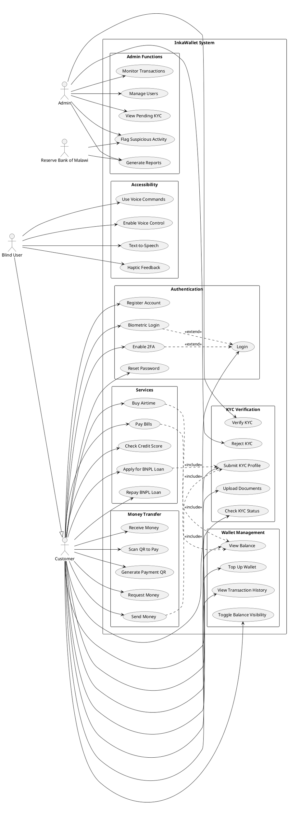
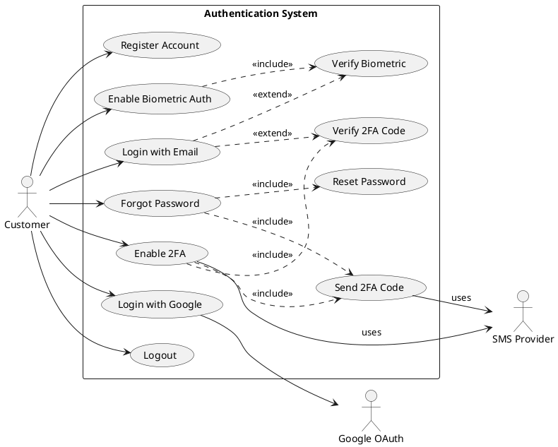
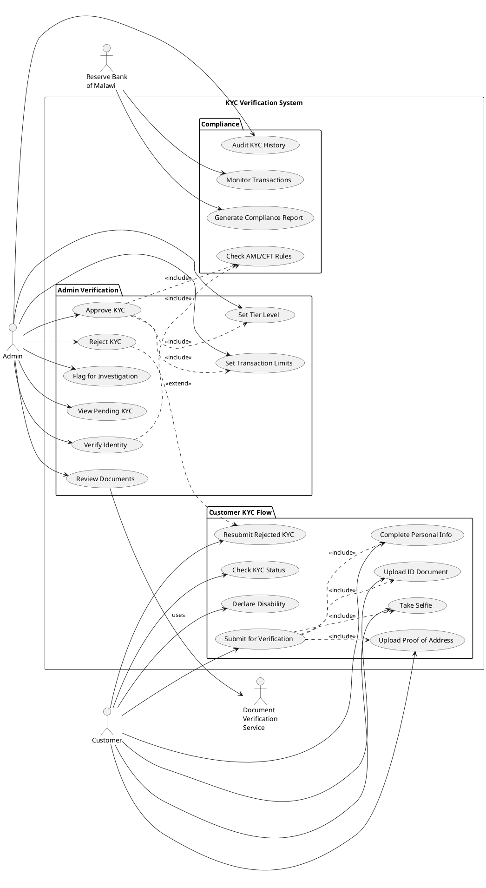
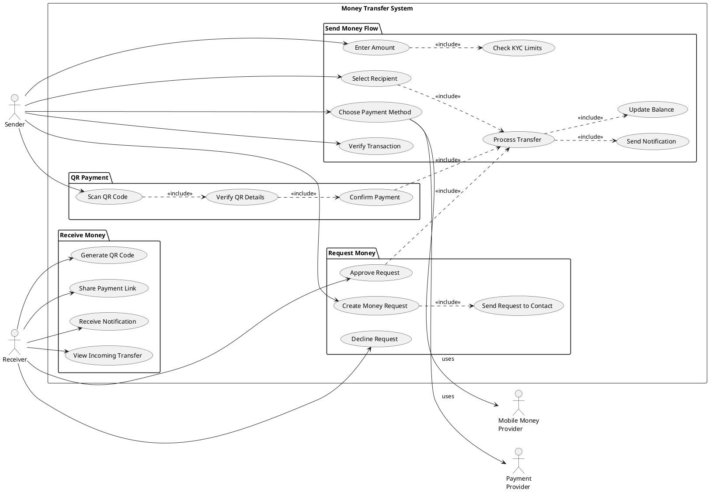
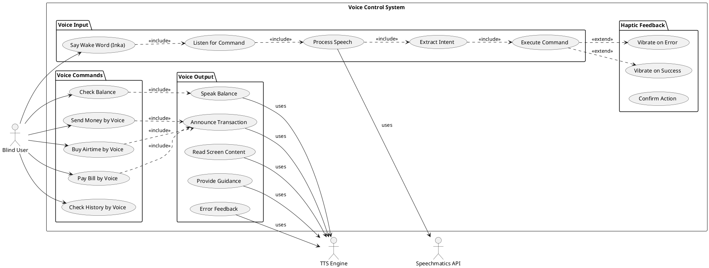

# InkaWallet Use Case Diagrams

## Main System Use Case Diagram

## Authentication Use Case Diagram (Detailed)

## KYC Verification Use Case Diagram

## Money Transfer Use Case Diagram

## Voice Control Use Case Diagram

## Use Case Descriptions

### UC1: Register Account

**Actor**: Customer  
**Preconditions**: None  
**Main Flow**:

1. User opens app and selects "Register"
2. User enters email, password, full name, phone number
3. System validates input
4. System creates account
5. System sends verification email
6. User verifies email
7. System activates account

**Alternative Flow**:

- User can register with Google OAuth
- System validates uniqueness of email/phone

**Postconditions**: User has active account

---

### UC24: Submit KYC Profile

**Actor**: Customer  
**Preconditions**: User is logged in  
**Main Flow**:

1. User navigates to Settings → KYC Verification
2. User fills personal information form
3. User uploads required documents (ID, selfie, proof of address)
4. User declares disability status (if applicable)
5. System validates all required fields
6. User submits for verification
7. System creates KYC profile with status "pending_verification"
8. System notifies admin team
9. System sends confirmation to user

**Alternative Flow**:

- If documents missing, system prompts user to upload
- If disability declared, system enables accessibility features

**Postconditions**: KYC profile created with pending status

---

### UC20: Use Voice Commands

**Actor**: Blind User  
**Preconditions**: Voice control enabled in settings  
**Main Flow**:

1. User says "Inka" (wake word)
2. System listens for command
3. User says command (e.g., "check balance")
4. System processes speech using Speechmatics
5. System extracts intent
6. System executes command
7. System announces result via text-to-speech
8. System provides haptic feedback

**Alternative Flow**:

- If command unclear, system asks for clarification
- If error occurs, system announces error and vibrates

**Postconditions**: Command executed, user receives audio/haptic feedback
